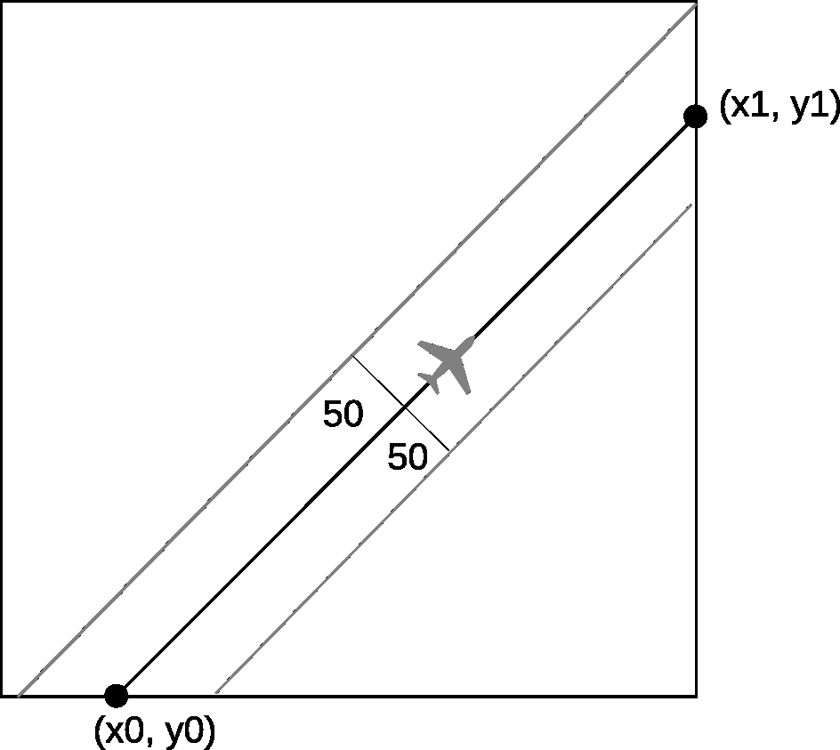

Assignement


### Task 1: Forest Fire

A message has been received about a possible forest fire in a given square. For locating the fire, N airplanes were dispatched. However, none of the crews detected a fire.
It is known that from the airplane, a strip of forest is visible with boundaries located at 50 km to the right and left of the line on the Earth's surface over which the airplane flies
(see the diagram). Points located exactly 50 km from this line are still visible.


The report from each airplane contained information about two distinct points (x0, y0) and (x1, y1) where the airplane entered the given square and exited it, respectively.
Between these points, the airplane moved strictly in a straight line.

### Requirements

Write a program that determines whether the entire given square of forest was viewed by the airplanes. 
If not, the program should find the coordinates of some point lying inside or on the border of the square that was not covered by any of the viewed strips.
The program execution time is limited to 10 seconds.
RAM consumption is limited to 4GB.
The program must terminate correctly.
The program must be written in C or C++. Developer must use only standard library.

### Input Data

The input file named INPUT consists of N + 2 lines.
The first line contains a natural number L - the size of the given forest square in kilometers (0 < L <= 1000).
The second line contains a natural number N (1 <= N <= 100) - the number of airplanes.
Each of the following N lines contains a report from an airplane - four real coordinates x0, y0, x1, y1.
The coordinates are specified in kilometers.
The sides of the forest square are parallel to the coordinate axes, its bottom-left corner is located at the point with coordinates (0, 0), and the top-right corner is at the point (L, L).

### Output Data

The output file named OUTPUT shall contain one line.
If the given square has been completely viewed, this line should consist of the word "OK" written in uppercase.
Otherwise, this line should contain the coordinates x and y of some point that did not fall into any of the viewed strips, separated by a space.
The coordinates should be printed in kilometers with an error not exceeding one meter.
The program shall print to OUTPUT the word "ERROR" in case if input data is incorrect.

### Example Input File

```
120
12
17.4 23 33.27 99.861
...
```

### Example Output File

```
92.59 41
```
