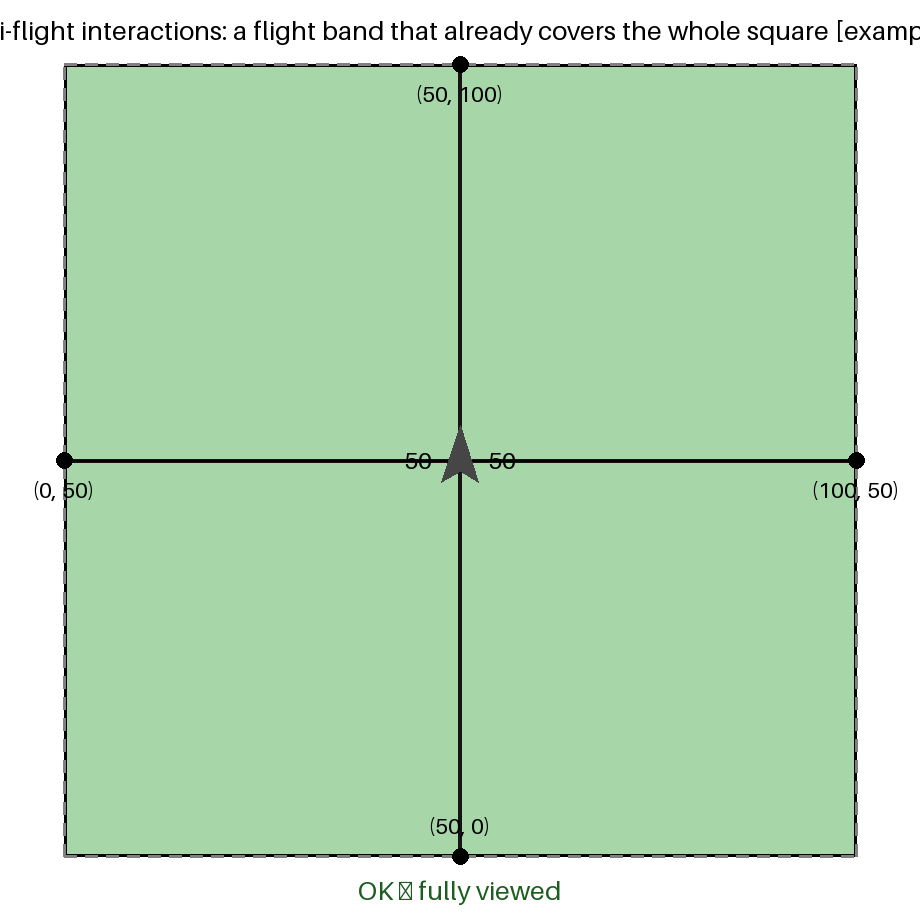
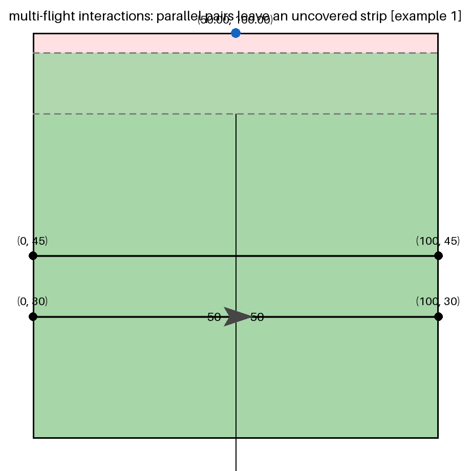
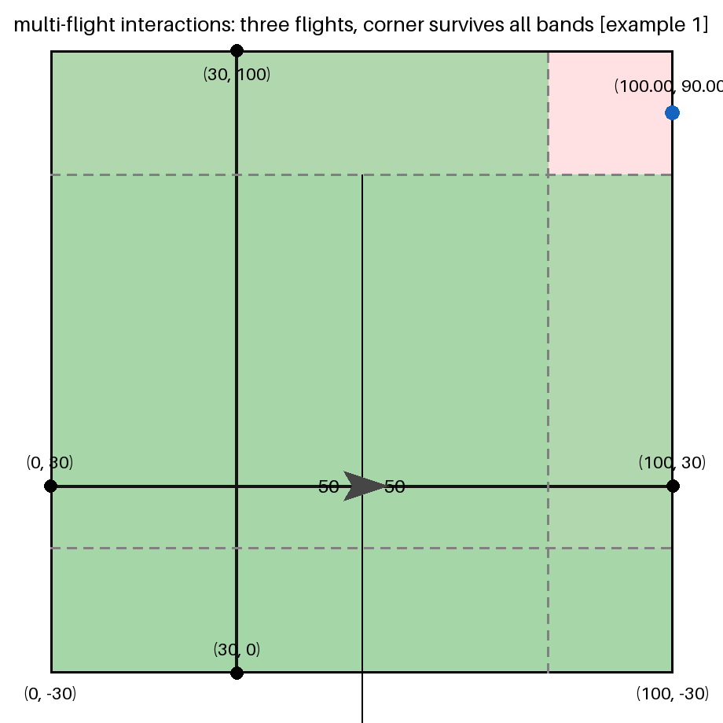
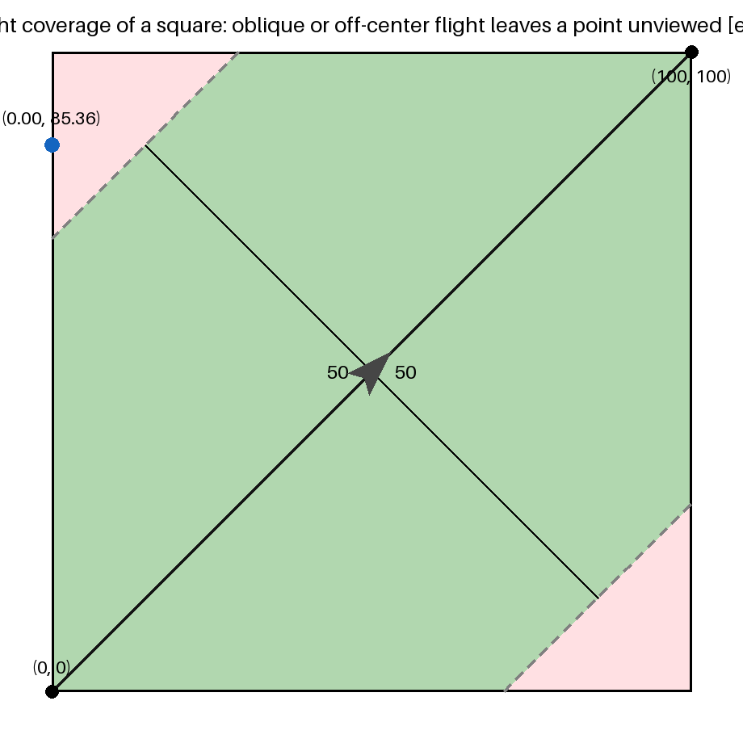
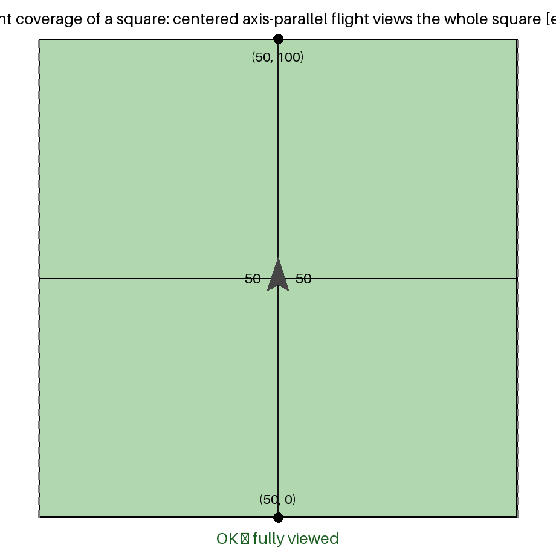
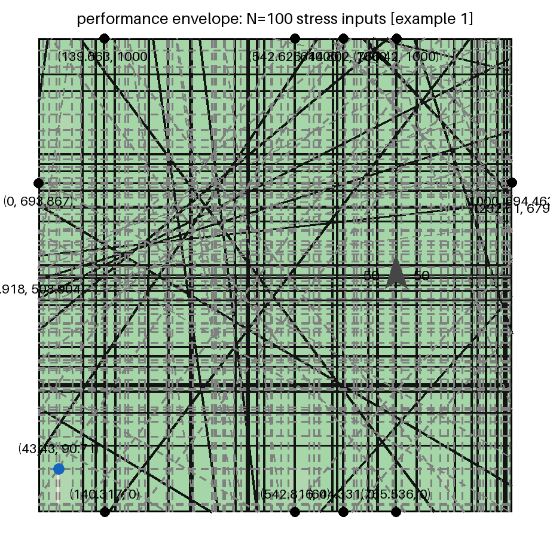
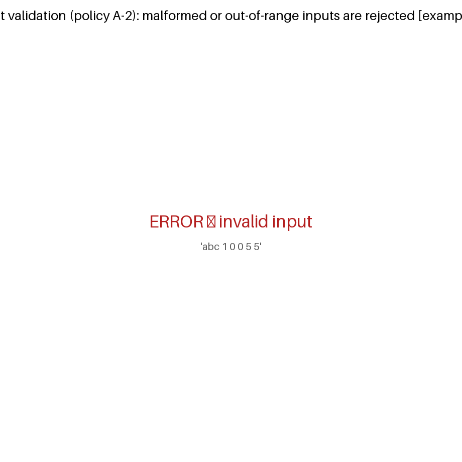

# BUILD_RECORD.md — pinned toolchain and verification record

Per PROJECT_PLAN.md §8.2 (DO-330 tool qualification mindset): this file is
part of the release record. A compiler or flag change is a **re-verification
event**, not a dependency refresh.

## Toolchain

| Component | Version |
|---|---|
| OS | Linux (Ubuntu 25.x, x86-64) |
| `g++` | 15.2.0 (Ubuntu 15.2.0-16ubuntu1) |
| `python3` | 3.14 (oracle only; not part of the shipped artifact) |
| `make` | GNU Make |

## Standard build (graded artifact)

```sh
make all
# equivalent to:
g++ -std=c++17 -O2 -Wall -Wextra -Wpedantic \
    -o build/forest src/main.cpp src/input.cpp src/geometry.cpp \
    src/scanner.cpp src/output.cpp src/run.cpp
```

Flags rationale:

| Flag | Why |
|---|---|
| `-std=c++17` | Required language level; standard library only (task rule) |
| `-O2` | Speed with predictable codegen; **no** `-ffast-math` (determinism, DR-10) |
| `-Wall -Wextra -Wpedantic` | Zero-warning policy |

Notes:

- No third-party libraries; the submission translation units depend on the
  C++17 standard library only (plan §12).
- No parallelism, no clock reads in the decision path — bitwise-reproducible
  output on the pinned toolchain (DR-10).

## Verification configurations

| Target | Flags | Purpose |
|---|---|---|
| `make test` | as above | Unit tests TC-U01..U22 + acceptance fixtures |
| `make sanitize` | `-O1 -g -fsanitize=address,undefined -fno-omit-frame-pointer` | ASan+UBSan over all fixtures; zero findings required (TC-19) |
| `make coverage` / `make report` | `-O0 -g --coverage` | gcov structural coverage; counters of both coverage binaries (same program name `forest` in `build/cov/fixture` and `build/cov/unit`) are overlaid with `gcov-tool merge` (TC + §9.5) |
| `make timing` | as graded build | TC-04/TC-17 wall time + peak RSS |
| `make oracle` | python3 tools/verify_random.py | Differential testing vs. independent oracle |
| `make cucumber` | python3 tools/cucumber.py | Gherkin BDD layer: 55 scenarios across 4 `.feature` files (many x0/y0/x1/y1 example rows); every run is verified by the independent oracle, rendered to a PNG (viewed band green / unviewed red, reference-figure style) in `build/cucumber/images/`, and reported in a per-scenario timing table (`build/cucumber/timing.md`). `make cucumber-smoke` runs the tagged @timing subset |

## Structural coverage result (§9.5, merged fixtures + unit tests)

Re-measured 2026-09-16 after the `scanSquare` decomposition (see the
re-verification section below).

| File | Line coverage |
|---|---|
| `src/main.cpp` | 100% |
| `src/output.cpp` | 100% |
| `src/geometry.cpp` | 100% |
| `src/scanner.cpp` | 100% of statements — 3 closing braces (`buildFences`, `clipFencesToSquare`, `collectSplitParameters`) sit in gcov exception-unwinding regions; justified in PROJECT_PLAN.md §9.6 |
| `src/input.cpp` | 97.7% — 1 defensive line, justified in PROJECT_PLAN.md §9.6 |
| `src/run.cpp` | 78.6% — `catch (...)` defensive handler, justified in §9.6 |

## Verification results — 2026-09-15

| Check | Result |
|---|---|
| Warning-free build (`-Wall -Wextra -Wpedantic`) | PASS (0 warnings) |
| Unit tests TC-U01..U22 | PASS (22/22) |
| Acceptance fixtures TC-01..TC-17, TC-20 (+TC-10 synthesized) | PASS (20/20, exit 0, exact OUTPUT match) |
| Oracle validation of all fixture outputs | PASS (20/20) |
| Randomized differential testing (`make oracle`, 50 trials, seed 20260915) | PASS (50/50) |
| ASan + UBSan over all fixtures | PASS (0 findings) |
| TC-04/TC-17 timing (N=100 stress) | PASS (0.10 s wall vs 10 s limit) |
| Peak RSS | ~7.5 MB vs 4 GB limit |
| Structural coverage | 100% lines on main/output/geometry/scanner; residual lines justified (plan §9.6) |
| Gherkin scenarios (`make cucumber`) | PASS (55/55, oracle-verified, images + timing table generated) |
| Gherkin report in this file | Regenerated by `make gherkin-report`; see the section below (scenarios, example rows, results, coverage images in `assets/cucumber/`) |

## Re-verification after `scanSquare` decomposition — 2026-09-16

`scanSquare` was split into one function per phase/loop (`buildFences`,
`clipFencesToSquare`, `collectSplitParameters`, `uncoveredMargin`,
`probePieceMidpoint`); the orchestrator keeps the original phase order and
computation sequence. Full battery re-run on the refactored code:

| Check | Result |
|---|---|
| Warning-free rebuild | PASS (0 warnings) |
| Unit tests TC-U01..U22 | PASS (22/22) |
| Acceptance fixtures | PASS (20/20, exact OUTPUT match; TC-20 added 2026-09-16) |
| ASan + UBSan over all fixtures | PASS (0 findings) |
| Randomized differential testing (`make oracle`) | PASS (50/50) |
| TC-04/TC-17 timing | PASS — 0.10 s wall, 7.4–7.7 MB RSS (unchanged) |
| Gherkin suite (`make cucumber`) | PASS (55/55 in 3.35 s); program time ≤ 3.5 ms per scenario, worst N=100 stress 2.1–3.5 ms |
| Structural coverage | scanner.cpp 100% of statements; 3 closing braces in unwinding regions justified (plan §9.6); all other files unchanged |

Observed timing deltas vs. the pre-refactor monolith: none outside run-to-run
noise. `make timing` still reports 0.10 s wall for both N=100 stress fixtures
(identical to 2026-09-15), peak RSS moved from ~7.5 MB to 7.4–7.7 MB
(allocator noise, same order). This is expected: `-O2` inlines the small
helpers back into the hot loops, so the decomposition costs nothing at run
time while giving each phase a reviewable, individually testable unit.
<!-- GHERKIN-REPORT:BEGIN -->
## Gherkin (BDD) scenario report — `make cucumber`

Generated from `tests/features/*.feature` by `tools/cucumber.py`; last full run: **55/55 scenarios passed, total 3.17 s**. Every scenario executes the graded binary in a sandbox and its output is independently re-verified by the Python oracle (`tools/verify_random.py`) before the expectation is asserted. A coverage image is rendered per scenario into `assets/cucumber/` (green = viewed band, red = unviewed, black = flight line, dashed gray = ±50 km band edges, ✈ = plane at the segment midpoint, blue dot = reported uncovered point); the first image of each outline is embedded, the rest are linked from the result tables.

### Feature file: `tests/features/multi_flight.feature` (16 scenarios)

#### a flight band that already covers the whole square

Example rows exercised (from the feature source):

*Examples: one band spans the square edge to edge*

```gherkin
| x0a | y0a | x1a  | y1a  | x0b | y0b | x1b  | y1b  |
| 50  | 0   | 50   | 100  | 0   | 50  | 100  | 50   |
| 50  | 0   | 50   | 100  | 0   | 0   | 100  | 100  |
| 50  | 0   | 50   | 100  | 0   | 40  | 100  | 40   |
| 0   | 50  | 100  | 50   | 0   | 40  | 100  | 40   |
| 0   | -50 | 100  | -50  | 0   | 50  | 100  | 50   |
| 50  | 0   | 50   | 100  | -30 | -30 | 130  | 130  |
```



| # | Result | Reported | dmin (km) | run ms | wall ms | Coverage image |
|---|---|---|---|---|---|---|
| 1 | PASS | OK | - | 2.1 | 24.5 | [001](../assets/cucumber/001_multi-flight_interactions_a_flight_band_that_already_covers_the_whole_.png) |
| 2 | PASS | OK | - | 2.1 | 26.7 | [002](../assets/cucumber/002_multi-flight_interactions_a_flight_band_that_already_covers_the_whole_.png) |
| 3 | PASS | OK | - | 1.7 | 28.6 | [003](../assets/cucumber/003_multi-flight_interactions_a_flight_band_that_already_covers_the_whole_.png) |
| 4 | PASS | OK | - | 2.0 | 25.8 | [004](../assets/cucumber/004_multi-flight_interactions_a_flight_band_that_already_covers_the_whole_.png) |
| 5 | PASS | OK | - | 1.8 | 39.6 | [005](../assets/cucumber/005_multi-flight_interactions_a_flight_band_that_already_covers_the_whole_.png) |
| 6 | PASS | OK | - | 2.0 | 30.1 | [006](../assets/cucumber/006_multi-flight_interactions_a_flight_band_that_already_covers_the_whole_.png) |

#### parallel pairs leave an uncovered strip

Example rows exercised (from the feature source):

*Examples: strips of various widths near a corner*

```gherkin
| x0a | y0a | x1a | y1a | x0b | y0b  | x1b | y1b  |
| 0   | 30  | 100 | 30  | 0   | 45   | 100 | 45   |
| 0   | 30  | 100 | 30  | 0   | 40   | 100 | 40   |
| 0   | -20 | 100 | -20 | 0   | 0    | 100 | 0    |
| 0   | 30  | 100 | 30  | 0   | 30.5 | 100 | 30.5 |
| -60 | -20 | 60  | -20 | -60 | 0    | 60  | 0    |
```

*Examples: perpendicular pair missing one corner*

```gherkin
| x0a | y0a | x1a | y1a | x0b | y0b | x1b | y1b |
| 0   | 30  | 100 | 30  | 30  | 0   | 30  | 100 |
| -20 | 0   | -20 | 100 | 0   | -20 | 100 | -20 |
| 0   | -20 | 100 | -20 | 40  | -20 | 40  | 120 |
```



| # | Result | Reported | dmin (km) | run ms | wall ms | Coverage image |
|---|---|---|---|---|---|---|
| 7 | PASS | (50.00, 100.00) | 54.9999 | 2.0 | 2.3 | [007](../assets/cucumber/007_multi-flight_interactions_parallel_pairs_leave_an_uncovered_strip_exam.png) |
| 8 | PASS | (50.00, 100.00) | 59.9999 | 1.8 | 2.1 | [008](../assets/cucumber/008_multi-flight_interactions_parallel_pairs_leave_an_uncovered_strip_exam.png) |
| 9 | PASS | (50.00, 100.00) | 99.9999 | 2.1 | 2.4 | [009](../assets/cucumber/009_multi-flight_interactions_parallel_pairs_leave_an_uncovered_strip_exam.png) |
| 10 | PASS | (50.00, 100.00) | 69.4999 | 1.9 | 2.3 | [010](../assets/cucumber/010_multi-flight_interactions_parallel_pairs_leave_an_uncovered_strip_exam.png) |
| 11 | PASS | (50.00, 100.00) | 99.9999 | 2.0 | 2.3 | [011](../assets/cucumber/011_multi-flight_interactions_parallel_pairs_leave_an_uncovered_strip_exam.png) |
| 12 | PASS | (100.00, 90.00) | 60.0000 | 1.9 | 2.2 | [012](../assets/cucumber/012_multi-flight_interactions_parallel_pairs_leave_an_uncovered_strip_exam.png) |
| 13 | PASS | (100.00, 65.00) | 85.0000 | 1.8 | 2.1 | [013](../assets/cucumber/013_multi-flight_interactions_parallel_pairs_leave_an_uncovered_strip_exam.png) |
| 14 | PASS | (100.00, 65.00) | 59.9999 | 2.1 | 2.4 | [014](../assets/cucumber/014_multi-flight_interactions_parallel_pairs_leave_an_uncovered_strip_exam.png) |

#### three flights, corner survives all bands

Example rows exercised (from the feature source):

*Examples: strips of various widths near a corner*

```gherkin
| x0a | y0a | x1a | y1a | x0b | y0b | x1b | y1b | x0c | y0c | x1c | y1c |
| 0   | 30  | 100 | 30  | 30  | 0   | 30  | 100 | 0   | -30 | 100 | -30 |
| 0   | 40  | 100 | 40  | 40  | 0   | 40  | 100 | 0   | -30 | 100 | -30 |
```



| # | Result | Reported | dmin (km) | run ms | wall ms | Coverage image |
|---|---|---|---|---|---|---|
| 15 | PASS | (100.00, 90.00) | 60.0000 | 2.1 | 2.5 | [015](../assets/cucumber/015_multi-flight_interactions_three_flights_corner_survives_all_bands_exam.png) |
| 16 | PASS | (100.00, 95.00) | 55.0000 | 1.9 | 2.1 | [016](../assets/cucumber/016_multi-flight_interactions_three_flights_corner_survives_all_bands_exam.png) |

### Feature file: `tests/features/single_flight.feature` (23 scenarios)

#### oblique or off-center flight leaves a point unviewed

Example rows exercised (from the feature source):

*Examples: corner-to-corner diagonals*

```gherkin
| x0 | y0  | x1  | y1  |
| 0  | 0   | 100 | 100 |
| 0  | 100 | 100 | 0   |
| 10 | 10  | 90  | 85  |
| 0  | 0   | 100 | 35  |
```

*Examples: chords that stay well inside the square*

```gherkin
| x0 | y0 | x1 | y1 |
| 20 | 20 | 80 | 80 |
| 10 | 90 | 90 | 90 |
| 45 | 0  | 55 | 100 |
```

*Examples: short segments near the middle*

```gherkin
| x0 | y0 | x1   | y1 |
| 40 | 20 | 60   | 20 |
| 50 | 40 | 50.5 | 60 |
```

*Examples: edge-hugging axis-parallel lines*

```gherkin
| x0 | y0 | x1  | y1 |
| 0  | 0  | 100 | 0  |
| 0  | 1  | 100 | 1  |
| 0  | 0  | 0   | 100 |
| 0  | 0  | 50  | 0  |
```

*Examples: lines outside the square (infinite line still counts)*

```gherkin
| x0  | y0  | x1  | y1 |
| -60 | -60 | -20 | -20 |
| 160 | 160 | 200 | 200 |
| -100 | -60 | 0 | -60 |
| 200 | -50 | 200 | 50 |
```



| # | Result | Reported | dmin (km) | run ms | wall ms | Coverage image |
|---|---|---|---|---|---|---|
| 17 | PASS | (0.00, 85.36) | 60.3553 | 2.1 | 2.4 | [017](../assets/cucumber/017_single-flight_coverage_of_a_square_oblique_or_off-center_flight_leaves.png) |
| 18 | PASS | (0.00, 14.64) | 60.3553 | 2.2 | 2.5 | [018](../assets/cucumber/018_single-flight_coverage_of_a_square_oblique_or_off-center_flight_leaves.png) |
| 19 | PASS | (0.00, 84.58) | 61.2488 | 1.6 | 1.9 | [019](../assets/cucumber/019_single-flight_coverage_of_a_square_oblique_or_off-center_flight_leaves.png) |
| 20 | PASS | (50.00, 100.00) | 77.8682 | 1.7 | 2.0 | [020](../assets/cucumber/020_single-flight_coverage_of_a_square_oblique_or_off-center_flight_leaves.png) |
| 21 | PASS | (0.00, 85.36) | 60.3553 | 1.8 | 2.2 | [021](../assets/cucumber/021_single-flight_coverage_of_a_square_oblique_or_off-center_flight_leaves.png) |
| 22 | PASS | (50.00, 0.00) | 89.9999 | 2.3 | 2.6 | [022](../assets/cucumber/022_single-flight_coverage_of_a_square_oblique_or_off-center_flight_leaves.png) |
| 23 | PASS | (2.38, 100.00) | 52.3635 | 2.5 | 2.9 | [023](../assets/cucumber/023_single-flight_coverage_of_a_square_oblique_or_off-center_flight_leaves.png) |
| 24 | PASS | (50.00, 100.00) | 79.9999 | 2.1 | 2.5 | [024](../assets/cucumber/024_single-flight_coverage_of_a_square_oblique_or_off-center_flight_leaves.png) |
| 25 | PASS | (0.74, 100.00) | 50.7420 | 1.8 | 2.1 | [025](../assets/cucumber/025_single-flight_coverage_of_a_square_oblique_or_off-center_flight_leaves.png) |
| 26 | PASS | (50.00, 100.00) | 99.9999 | 1.9 | 2.2 | [026](../assets/cucumber/026_single-flight_coverage_of_a_square_oblique_or_off-center_flight_leaves.png) |
| 27 | PASS | (50.00, 100.00) | 98.9999 | 1.9 | 2.2 | [027](../assets/cucumber/027_single-flight_coverage_of_a_square_oblique_or_off-center_flight_leaves.png) |
| 28 | PASS | (100.00, 50.00) | 99.9999 | 2.0 | 2.2 | [028](../assets/cucumber/028_single-flight_coverage_of_a_square_oblique_or_off-center_flight_leaves.png) |
| 29 | PASS | (50.00, 100.00) | 99.9999 | 1.8 | 2.0 | [029](../assets/cucumber/029_single-flight_coverage_of_a_square_oblique_or_off-center_flight_leaves.png) |
| 30 | PASS | (0.00, 85.36) | 60.3553 | 2.1 | 2.4 | [030](../assets/cucumber/030_single-flight_coverage_of_a_square_oblique_or_off-center_flight_leaves.png) |
| 31 | PASS | (0.00, 85.36) | 60.3553 | 2.1 | 2.5 | [031](../assets/cucumber/031_single-flight_coverage_of_a_square_oblique_or_off-center_flight_leaves.png) |
| 32 | PASS | (50.00, 100.00) | 159.9999 | 1.9 | 2.3 | [032](../assets/cucumber/032_single-flight_coverage_of_a_square_oblique_or_off-center_flight_leaves.png) |
| 33 | PASS | (0.00, 50.00) | 199.9999 | 1.7 | 2.0 | [033](../assets/cucumber/033_single-flight_coverage_of_a_square_oblique_or_off-center_flight_leaves.png) |

#### centered axis-parallel flight views the whole square

Example rows exercised (from the feature source):

*Examples: band edges exactly on the square edges*

```gherkin
| x0    | y0 | x1    | y1   |
| 50    | 0  | 50    | 100  |
| 50    | -5 | 50    | 105  |
| 0     | 50 | 100   | 50   |
| -5    | 50 | 105   | 50   |
| 49.75 | 50 | 50.25 | 50   |
| 50    | 50 | 50.01 | 50   |
```



| # | Result | Reported | dmin (km) | run ms | wall ms | Coverage image |
|---|---|---|---|---|---|---|
| 34 | PASS | OK | - | 1.9 | 21.9 | [034](../assets/cucumber/034_single-flight_coverage_of_a_square_centered_axis-parallel_flight_views.png) |
| 35 | PASS | OK | - | 2.0 | 23.5 | [035](../assets/cucumber/035_single-flight_coverage_of_a_square_centered_axis-parallel_flight_views.png) |
| 36 | PASS | OK | - | 1.7 | 24.7 | [036](../assets/cucumber/036_single-flight_coverage_of_a_square_centered_axis-parallel_flight_views.png) |
| 37 | PASS | OK | - | 2.0 | 21.8 | [037](../assets/cucumber/037_single-flight_coverage_of_a_square_centered_axis-parallel_flight_views.png) |
| 38 | PASS | OK | - | 1.9 | 21.5 | [038](../assets/cucumber/038_single-flight_coverage_of_a_square_centered_axis-parallel_flight_views.png) |
| 39 | PASS | OK | - | 2.0 | 23.9 | [039](../assets/cucumber/039_single-flight_coverage_of_a_square_centered_axis-parallel_flight_views.png) |

### Feature file: `tests/features/stress.feature` (3 scenarios)

#### N=100 stress inputs

Example rows exercised (from the feature source):

*Examples: largest, smallest, and nominal squares*

```gherkin
| L    |
| 1000 |
| 1    |
| 100  |
```



| # | Result | Reported | dmin (km) | run ms | wall ms | Coverage image |
|---|---|---|---|---|---|---|
| 40 | PASS | (43.43, 90.71) | 50.0001 | 3.1 | 4.1 | [040](../assets/cucumber/040_performance_envelope_N_100_stress_inputs_example_1_.png) |
| 41 | PASS | OK | - | 2.2 | 438.3 | [041](../assets/cucumber/041_performance_envelope_N_100_stress_inputs_example_2_.png) |
| 42 | PASS | OK | - | 2.2 | 413.4 | [042](../assets/cucumber/042_performance_envelope_N_100_stress_inputs_example_3_.png) |

### Feature file: `tests/features/validation.feature` (13 scenarios)

#### malformed or out-of-range inputs are rejected

Example rows exercised (from the feature source):

*Examples: every rejection class*

```gherkin
| text                       | reason                        |
| abc 1 0 0 5 5              | non-numeric L                 |
| 0 1 0 0 5 5                | L below range                 |
| 1001 1 0 0 5 5             | L above range                 |
| nan 1 0 0 5 5              | NaN L                         |
| 100                        | missing N                     |
| 100 0 0 0 5 5              | N below range                 |
| 100 101 0 0 5 5            | N above range                 |
| 100 1 0 0 5                | truncated coordinates         |
| 100 1 0 0 5 5 99           | extra token after last flight |
| 100 1 0 0 5 5 0 0 3 3      | more flights than N declares  |
| 100 1 5 5 5 5              | coincident endpoints          |
| 100 1 0 nan 5 5            | NaN coordinate                |
|                            | empty input                   |
```



| # | Result | Reported | dmin (km) | run ms | wall ms | Coverage image |
|---|---|---|---|---|---|---|
| 43 | PASS | ERROR | - | 2.1 | 2.3 | [043](../assets/cucumber/043_input_validation_policy_A-2__malformed_or_out-of-range_inputs_are_reje.png) |
| 44 | PASS | ERROR | - | 1.9 | 2.2 | [044](../assets/cucumber/044_input_validation_policy_A-2__malformed_or_out-of-range_inputs_are_reje.png) |
| 45 | PASS | ERROR | - | 1.8 | 2.1 | [045](../assets/cucumber/045_input_validation_policy_A-2__malformed_or_out-of-range_inputs_are_reje.png) |
| 46 | PASS | ERROR | - | 1.8 | 2.0 | [046](../assets/cucumber/046_input_validation_policy_A-2__malformed_or_out-of-range_inputs_are_reje.png) |
| 47 | PASS | ERROR | - | 1.8 | 2.0 | [047](../assets/cucumber/047_input_validation_policy_A-2__malformed_or_out-of-range_inputs_are_reje.png) |
| 48 | PASS | ERROR | - | 1.8 | 2.0 | [048](../assets/cucumber/048_input_validation_policy_A-2__malformed_or_out-of-range_inputs_are_reje.png) |
| 49 | PASS | ERROR | - | 2.1 | 2.4 | [049](../assets/cucumber/049_input_validation_policy_A-2__malformed_or_out-of-range_inputs_are_reje.png) |
| 50 | PASS | ERROR | - | 1.7 | 2.0 | [050](../assets/cucumber/050_input_validation_policy_A-2__malformed_or_out-of-range_inputs_are_reje.png) |
| 51 | PASS | ERROR | - | 1.9 | 2.2 | [051](../assets/cucumber/051_input_validation_policy_A-2__malformed_or_out-of-range_inputs_are_reje.png) |
| 52 | PASS | ERROR | - | 1.7 | 2.0 | [052](../assets/cucumber/052_input_validation_policy_A-2__malformed_or_out-of-range_inputs_are_reje.png) |
| 53 | PASS | ERROR | - | 1.8 | 2.1 | [053](../assets/cucumber/053_input_validation_policy_A-2__malformed_or_out-of-range_inputs_are_reje.png) |
| 54 | PASS | ERROR | - | 1.9 | 2.2 | [054](../assets/cucumber/054_input_validation_policy_A-2__malformed_or_out-of-range_inputs_are_reje.png) |
| 55 | PASS | ERROR | - | 1.7 | 1.9 | [055](../assets/cucumber/055_input_validation_policy_A-2__malformed_or_out-of-range_inputs_are_reje.png) |

<!-- GHERKIN-REPORT:END -->