# Project Plan — Forest Fire Coverage (Task 1)

**Program:** PerformaCode assignment — Task 1: Forest Fire
**Language:** C++17 (standard library only)
**Status:** Implemented — verification complete (results in docs/BUILD_RECORD.md)
**Date:** 2026-09-16 (§10.2 records plan-vs-actual status)

---

## Table of Contents

- [Diagram legend](#diagram-legend)
- [1. Overview](#1-overview)
- [2. Scope and Interpretations](#2-scope-and-interpretations)
- [3. Requirements](#3-requirements)
- [4. Architecture](#4-architecture)
- [5. Algorithm Design](#5-algorithm-design)
  - [5.0 The algorithm in plain English (with figures)](#50-the-algorithm-in-plain-english-with-figures)
  - [5.5 Alternative: incremental uncovered-set (Boolean subtraction)](#55-alternative-incremental-uncovered-set-boolean-subtraction)
  - [5.6 Why the fence scan cannot blow up exponentially (2ⁿ vs M²)](#56-why-the-fence-scan-cannot-blow-up-exponentially-2ⁿ-vs-m²)
- [6. Numerical Robustness](#6-numerical-robustness)
- [7. Real-Time Implementation](#7-real-time-implementation)
- [8. DO-178C and DO-330 Alignment](#8-do-178c-and-do-330-alignment)
- [9. Test Plan](#9-test-plan)
- [10. Schedule](#10-schedule)
- [11. Risks and Mitigations](#11-risks-and-mitigations)
- [12. Deliverables and Project Layout](#12-deliverables-and-project-layout)
- [Appendix A. Traceability Matrix](#appendix-a-traceability-matrix)
- [Appendix B. Reference Pseudocode](#appendix-b-reference-pseudocode)

---

## Diagram legend

All flow diagrams below use one consistent color code:

| Color | Meaning |
|---|---|
| 🟡 Yellow | File / user I/O |
| 🔵 Blue | Processing step |
| 🟠 Orange | Decision / branch |
| 🔴 Red | Error path (`ERROR` output) |
| 🟢 Green | Success output / accepted result |
| 🟣 Purple | Test / verification activity |
| 🩵 Teal | Real-time budget / timing |
| ⚪ Grey | Terminal or passive state |

---

## 1. Overview

A forest square `[0, L] × [0, L]` was scanned by `N` airplanes. Each airplane flew a
straight line between its reported entry and exit points; every point within
**50 km perpendicular distance of the flight line** is considered viewed (the
strip is an **infinite band** — decision confirmed with the stakeholder, see
[A-1](#2-scope-and-interpretations)). The program must decide whether the whole
square was viewed:

- **Fully viewed** → write `OK` to `OUTPUT`.
- **Not fully viewed** → write the coordinates `x y` of any unviewed point
  inside or on the border of the square, accurate to **1 meter (0.001 km)**.
- **Invalid input** → write `ERROR` to `OUTPUT`.

The solution must be *exact* (no sampling), *fast* (millisecond-scale against a
10 s limit) and *developed and verified with DO-178C / DO-330 discipline* as a
training exercise for the PerformaCode RTOS kernel engineer role.

### 1.1 Why the two naive approaches from the initial brainstorm were rejected

| Approach (from the initial brainstorm) | Verdict | Reason |
|---|---|---|
| Grid sampling at 0.5 km, refine boundaries | ❌ Rejected | Sampling can never *prove* coverage. Uncovered slivers between two nearly-parallel strip boundaries (e.g. angle 1e-6 rad) can be thinner than any grid step while every sampled point is covered → false `OK`. |
| Check only candidate vertices (band-boundary intersections) | ❌ Rejected | The claim "an uncovered region must contain an uncovered vertex" is false: every vertex of an uncovered cell lies *on* two strip boundaries, i.e. at exactly 50 km → **covered** by definition (boundary points are visible). Counterexample: three flights forming a triangle of inradius 80 km centered in an L = 1000 square — the inner uncovered triangle (inradius 30 km) has *all* vertices covered, yet is entirely unviewed. |
| Second code sample ("O(N log N) outline") | ❌ Not a program | Hardcodes `L = 120`, never reads `INPUT`, prints to stdout instead of `OUTPUT`. |
| Incremental uncovered-set: keep uncovered polygons, intersect each with every plane's band | ⚠️ Correct but not chosen | Exact (§5.5): the set always equals the uncovered region, and surviving vertices never move. Not chosen here: pieces can double every pass (2ⁿ worst case), convexity must be re-established each cut or ε-slivers produce a false `OK`, per-pass polygon bookkeeping, and no early exit — see §5.5 (P1–P4). |

The design below replaces both with an **exact arrangement-cell scan** that
proves coverage *and* finds an uncovered point when one exists, in O(M² log M)
with M = 2N + 4 ≤ 204 lines.

---

## 2. Scope and Interpretations

### 2.1 Stakeholder-confirmed decisions

| ID | Decision | Rationale |
|---|---|---|
| A-1 | **Infinite band model**: point visible iff perpendicular distance to the *infinite line* through (x0,y0)-(x1,y1) is ≤ 50 km. Capsule (segment-bounded) model explicitly **not** used. | Confirmed with stakeholder. Matches both Gemini attempts; simplest consistent reading of "the line over which the airplane flies". |
| A-2 | **Lenient validation.** `ERROR` only for: missing/unopenable `INPUT`, unparseable tokens, missing required tokens, L ∉ (0, 1000], N ∉ [1, 100], coincident entry/exit points of one flight, extra trailing tokens. Entry/exit points are **not** required to lie on the square boundary. | Confirmed with stakeholder. The provided example input (`17.4 23 ...` with L = 120) violates boundary entry, so strict checking would reject the example itself. |
| A-3 | L is parsed as a real number even though the spec says "natural number"; fractional L is accepted if in range. | Lenient-superset parsing never rejects valid spec inputs. |
| A-4 | Strip boundary points (distance exactly 50) are **visible** — comparison is `distance ≤ 50`. | Stated explicitly in the task ("Points located exactly 50 km ... are still visible"). |
| A-5 | The example `OUTPUT` value `92.59 41` is illustrative; the checker must accept *any* valid uncovered point. | The task says "some point". |

### 2.2 Out of scope (v1)

- Segment-capsule strip model (kept as risk R-1 mitigation; the coverage
  predicate is designed to be swappable, see [7.4](#74-swappable-coverage-predicate)).
- Floating-point exotica (denormals as input tokens, NaN/inf acceptance) beyond
  "stream extraction must succeed" — treated as ordinary real numbers; NaN/inf
  tokens are rejected by the range/distinctness checks.
- Parallelism / SIMD (not needed at N ≤ 100; would compromise determinism).

---

## 3. Requirements

### 3.1 Functional requirements (FR)

| ID | Requirement | Source |
|---|---|---|
| FR-01 | The program shall read all input from file `INPUT` in the working directory. | Spec |
| FR-02 | The program shall write exactly one line to file `OUTPUT` in the working directory. | Spec |
| FR-03 | If `INPUT` cannot be opened, the program shall write `ERROR` to `OUTPUT` (if openable) and terminate normally. | Spec |
| FR-04 | The program shall parse L and N, then N lines of four real values x0 y0 x1 y1. Any parse failure or missing token → `ERROR`. | Spec |
| FR-05 | The program shall validate 0 < L ≤ 1000; violation → `ERROR`. | Spec |
| FR-06 | The program shall validate 1 ≤ N ≤ 100 (integer); violation → `ERROR`. | Spec |
| FR-07 | For each flight, entry and exit points shall be distinct (Euclidean distance > 0); violation → `ERROR`. | Spec ("two distinct points") |
| FR-08 | Extra non-whitespace tokens after the N flight lines → `ERROR`. | Derived (defensive, A-2) |
| FR-09 | A point p is *viewed* iff min over flights of perpendicular distance to the flight line ≤ 50 km (boundary inclusive). | Spec + A-1/A-4 |
| FR-10 | If every point of the closed square is viewed, write `OK`; otherwise write `x y` of an unviewed point inside or on the border of the square. | Spec |
| FR-11 | Output coordinates shall be accurate to ≤ 0.001 km and formatted fixed-point with at least 3 (target 6) decimals. | Spec |
| FR-12 | The program shall terminate normally (exit code 0) in all cases within 10 s using ≤ 4 GB RAM. | Spec |

### 3.2 Derived requirements (DR)

| ID | Derived requirement | Traces to |
|---|---|---|
| DR-01 | Normalize each flight line to (a, b, c) with a² + b² = 1 so signed distance = a·x + b·y + c. | FR-09 |
| DR-02 | The arrangement consists of the 2N band boundaries (s = ±50) plus the 4 square edges; M = 2N + 4 ≤ 204 lines. | FR-09, FR-10 |
| DR-03 | Each arrangement line is clipped to the square and split at every other line's intersection; only elementary subsegments remain. | FR-10 |
| DR-04 | Each elementary subsegment midpoint is nudged by ε = 1e-4 km (10 cm) to both sides along the unit normal; nudged points outside the square are discarded. (Raised from the draft's 1e-7 during implementation: 10 cm is ~2·10⁸ × the FP noise floor, and the residual sub-2ε blind window, R-2, stays far below any realistic test hole.) | FR-10, FR-11 |
| DR-05 | A candidate point is *unviewed* iff min distance > 50 + kMarginAccept, kMarginAccept = 1e-6 km (1 mm). | FR-09, FR-11 |
| DR-06 | Among all unviewed candidates, the one with maximum margin (min distance − 50) is printed — maximizes robustness against checker tolerance. | FR-11 |
| DR-07 | Containers are right-sized up front (M = 2N + 4 ≤ 204 fences, per-fence split lists); candidate pokes are streamed and never stored; `std::vector` buffers are `reserve`d so measured peak RSS stays ~7.6 MB, dominated by the C++ runtime. | FR-12 |
| DR-08 | No recursion and no exceptions past `main`'s top-level guard; dynamic allocation is confined to small startup-phase buffers that are sized once via `reserve` (RCMA-equivalent discipline: allocation is not forbidden, *unbounded* growth is). | FR-12 |
| DR-09 | Split parameters are used as collected: exact duplicate t's can only create zero-length pieces whose probes re-poke the same midpoint (benign), so no dedupe pass is needed; the 1e-9 *interior test* tolerance at the split point is the actual noise guard. | FR-10 |
| DR-10 | Output is deterministic: identical input → bitwise identical output on the pinned toolchain. | FR-12, DO-330 |

---

## 4. Architecture

### 4.1 Top-level data flow

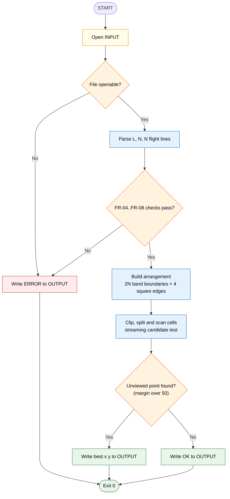
```mermaid
flowchart TD
    S(["START"]) --> IO1["Open INPUT"]
    IO1 --> V1{"File openable?"}
    V1 -->|"No"| ERR["Write ERROR to OUTPUT"]
    V1 -->|"Yes"| P1["Parse L, N, N flight lines"]
    P1 --> V2{"FR-04..FR-08 checks pass?"}
    V2 -->|"No"| ERR
    V2 -->|"Yes"| GEO["Build arrangement<br/>2N band boundaries + 4 square edges"]
    GEO --> SCAN["Clip, split and scan cells<br/>streaming candidate test"]
    SCAN --> D2{"Unviewed point found?<br/>(margin over 50)"}
    D2 -->|"Yes"| OUT2["Write best x y to OUTPUT"]
    D2 -->|"No"| OUT1["Write OK to OUTPUT"]
    OUT1 --> F(["Exit 0"])
    OUT2 --> F
    ERR --> F

    classDef io fill:#fffde7,stroke:#f57f17,color:#000
    classDef proc fill:#e3f2fd,stroke:#1565c0,color:#000
    classDef dec fill:#fff3e0,stroke:#ef6c00,color:#000
    classDef err fill:#ffebee,stroke:#c62828,color:#000
    classDef good fill:#e8f5e9,stroke:#2e7d32,color:#000
    class IO1 io
    class P1,GEO,SCAN proc
    class V1,V2,D2 dec
    class ERR err
    class OUT1,OUT2,F good
```

### 4.2 Runtime state machine

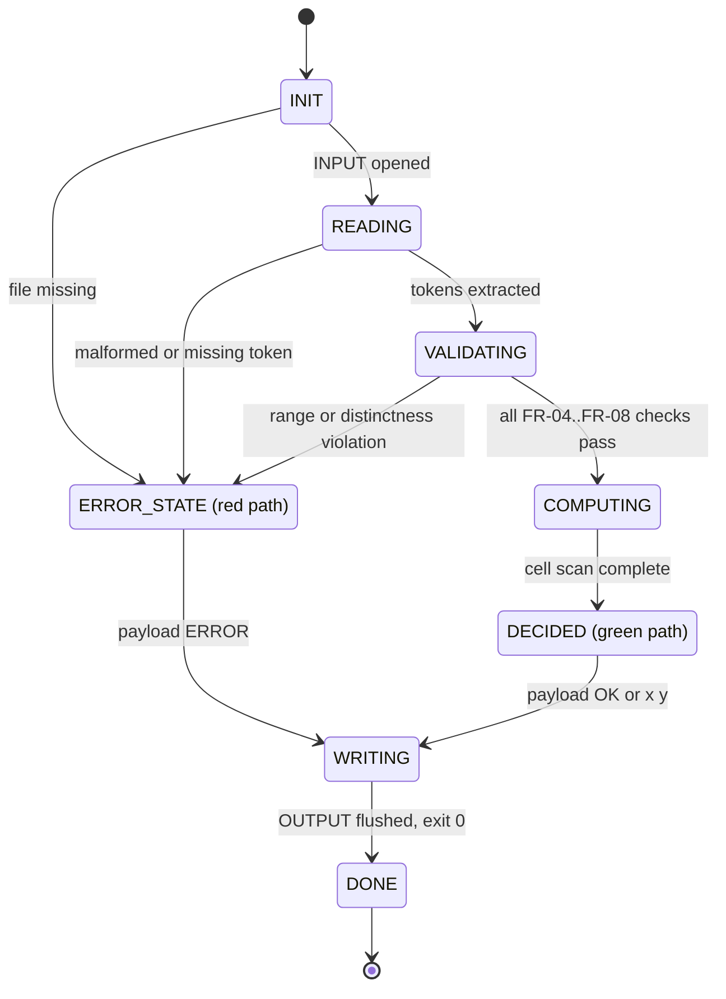
```mermaid
stateDiagram-v2
    [*] --> INIT
    INIT --> READING: INPUT opened
    INIT --> ERROR_STATE: file missing
    READING --> VALIDATING: tokens extracted
    READING --> ERROR_STATE: malformed or missing token
    VALIDATING --> COMPUTING: all FR-04..FR-08 checks pass
    VALIDATING --> ERROR_STATE: range or distinctness violation
    COMPUTING --> DECIDED: cell scan complete
    ERROR_STATE --> WRITING: payload ERROR
    DECIDED --> WRITING: payload OK or x y
    WRITING --> DONE: OUTPUT flushed, exit 0
    DONE --> [*]

    ERROR_STATE: ERROR_STATE (red path)
    DECIDED: DECIDED (green path)
```

### 4.3 Component view and responsibilities

| Component | Responsibility | Key functions | Requirements |
|---|---|---|---|
| `InputReader` | Open, tokenize, validate raw input | `parseL`, `parseN`, `parseFlights`, `checkNoExtraTokens` | FR-01, FR-04..FR-08 |
| `Geometry` | Normalize lines, build and clip arrangement | `normalizeLine`, `buildArrangement`, `clipLineToSquare` | DR-01..DR-03 |
| `Scanner` | Enumerate cells, nudge, test, select best point | `scanSquare` orchestrates: `buildFences`, `clipFencesToSquare`, `collectSplitParameters`, `probePieceMidpoint`, `uncoveredMargin` | DR-04..DR-06 |
| `OutputWriter` | Format and write the single output line | `writeOk`, `writePoint`, `writeError` | FR-02, FR-10, FR-11 |
| `Watchdog` (optional, compile-time) | Phase progress counters for external supervision | `RT_TRACE` macro | DR-08, §7 |

### 4.4 Component interaction (happy path and error path)

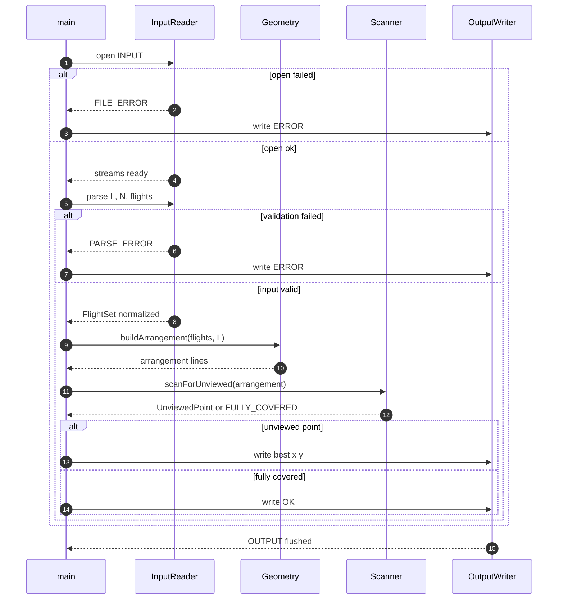
```mermaid
sequenceDiagram
    autonumber
    participant M as main
    participant IO as InputReader
    participant G as Geometry
    participant SC as Scanner
    participant OW as OutputWriter

    M->>IO: open INPUT
    alt open failed
        IO-->>M: FILE_ERROR
        M->>OW: write ERROR
    else open ok
        IO-->>M: streams ready
        M->>IO: parse L, N, flights
        alt validation failed
            IO-->>M: PARSE_ERROR
            M->>OW: write ERROR
        else input valid
            IO-->>M: FlightSet normalized
            M->>G: buildArrangement(flights, L)
            G-->>M: arrangement lines
            M->>SC: scanForUnviewed(arrangement)
            SC-->>M: UnviewedPoint or FULLY_COVERED
            alt unviewed point
                M->>OW: write best x y
            else fully covered
                M->>OW: write OK
            end
        end
    end
    OW-->>M: OUTPUT flushed
```

---

## 5. Algorithm Design

### 5.0 The algorithm in plain English (with figures)

**One-sentence version:** treat the *edges* of everything the planes saw as
fences, walk every fence, and peek 10 cm to each side of it — if any peek lands
on ground no plane saw, print that spot; if every peek saw a plane, the whole
square was watched.

> **The idea in one line:** an unseen patch of forest cannot hide from a
> program that checks *right beside* every boundary of every seen region.

#### The figures

PNG renders of the vector originals (the `.svg` files stay in `assets/` for editing).

| # | Picture | What it shows |
|---|---------|---------------|
| 1 | 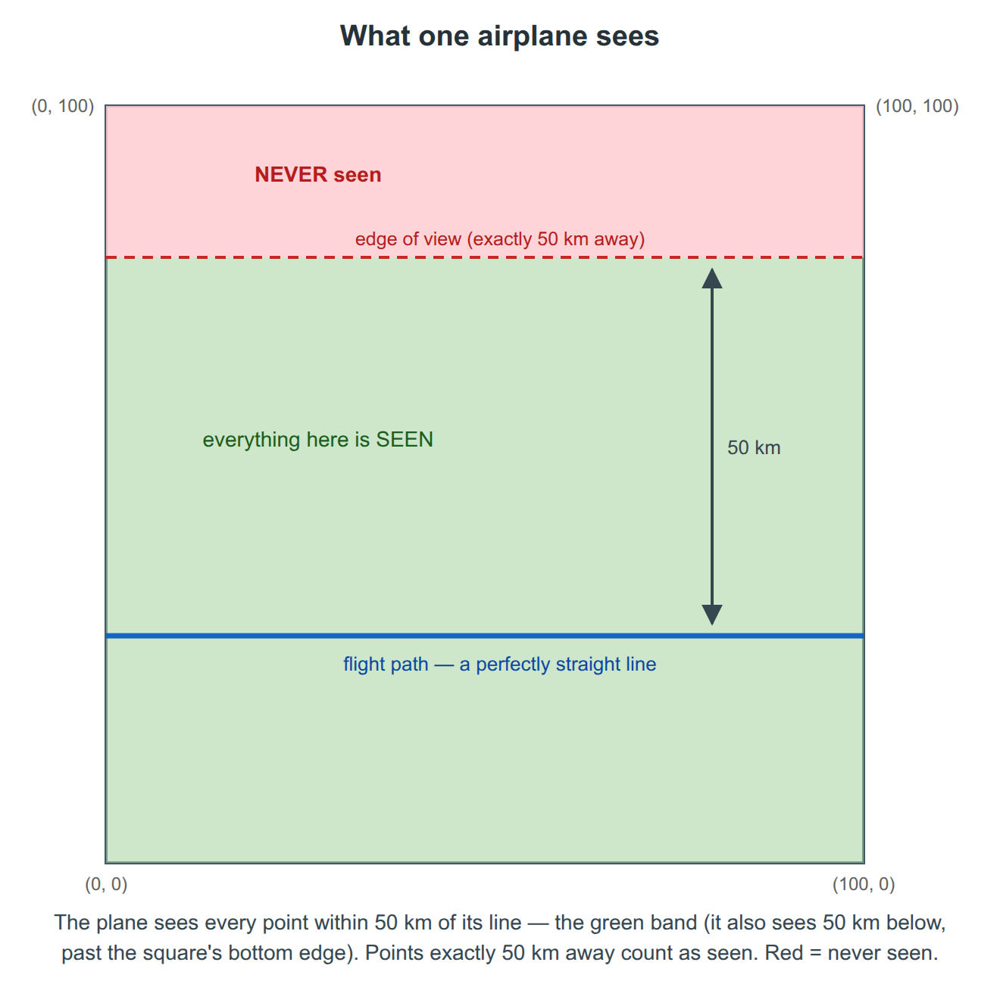 | A flight is just a straight line; the plane sees a 100 km-wide band around it. Points at exactly 50 km count as seen. |
| 2 | 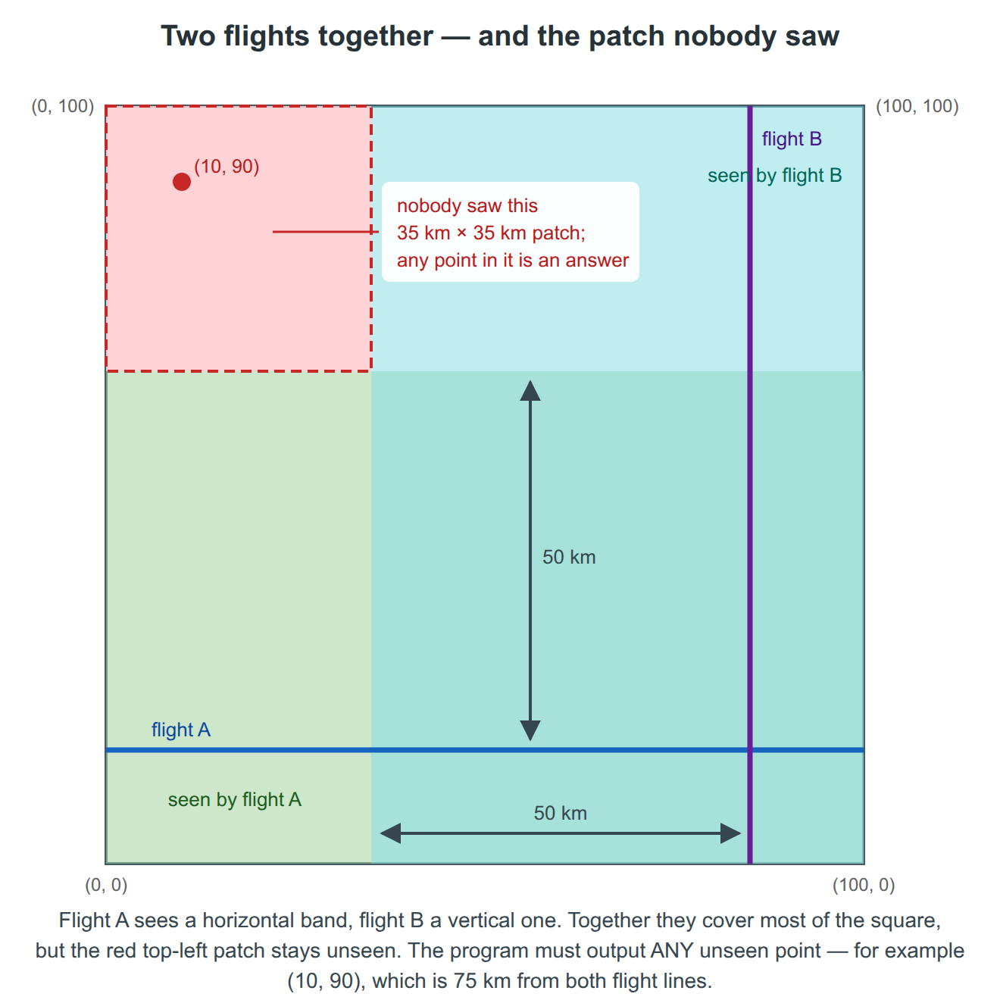 | Two bands cover most of the square but miss the top-left corner — any point in the patch is a valid answer. |
| 3 | 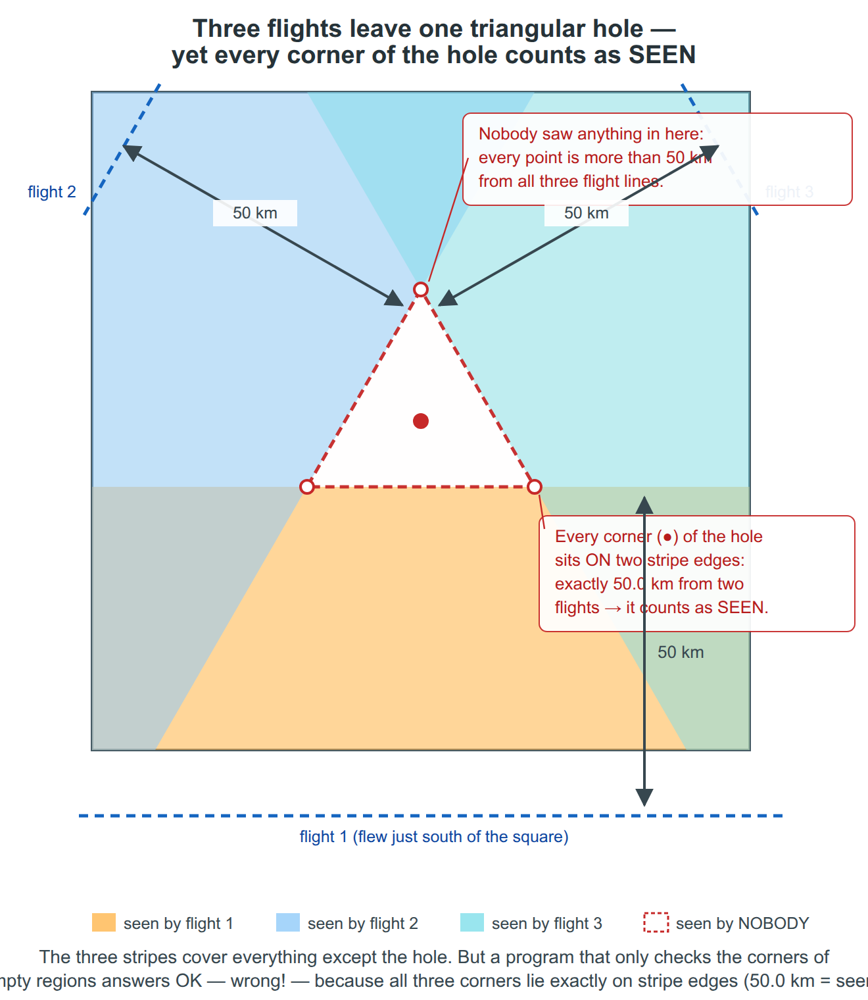 | Three flights leave a triangular hole whose three **corners all lie exactly on band edges** — so the corners themselves count as SEEN. Programs that only test region corners (the rejected vertex-only approach, §1.1) answer `OK` here. Wrong. |
| 4 | 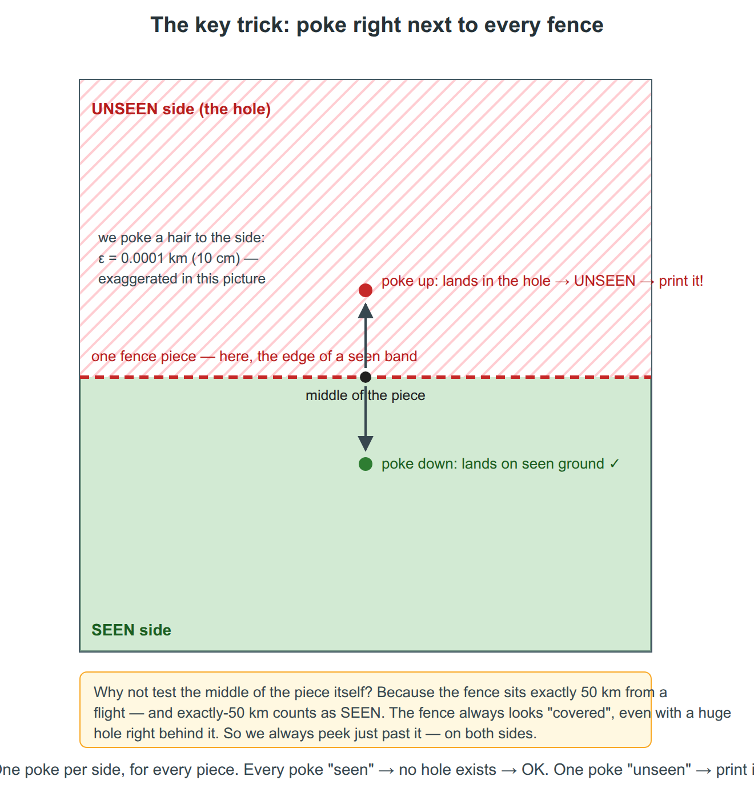 | The boundary itself always tests "seen" (it is exactly 50 km from a plane). So we test a hair to the side — on **both** sides. |
| 5 | 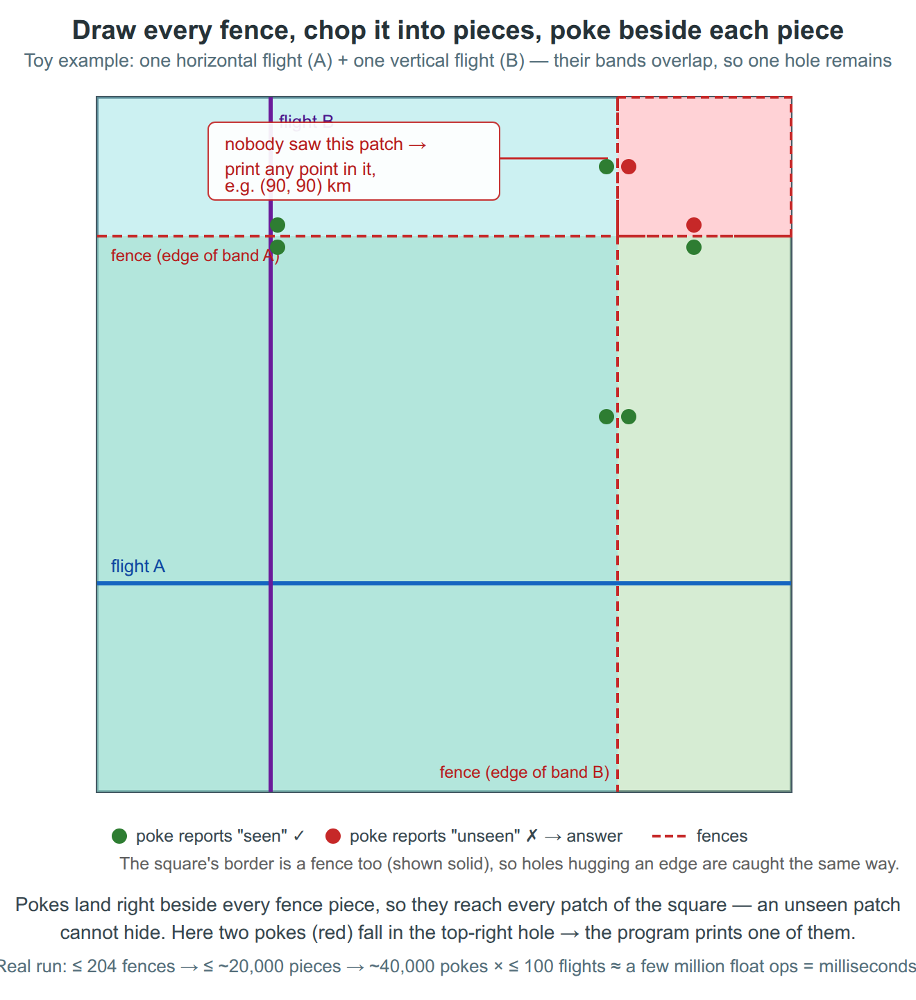 | Every fence is cut into pieces at crossings; each piece's midpoint gets two pokes. Here one poke lands in the hole → answer found. |
| 6 | 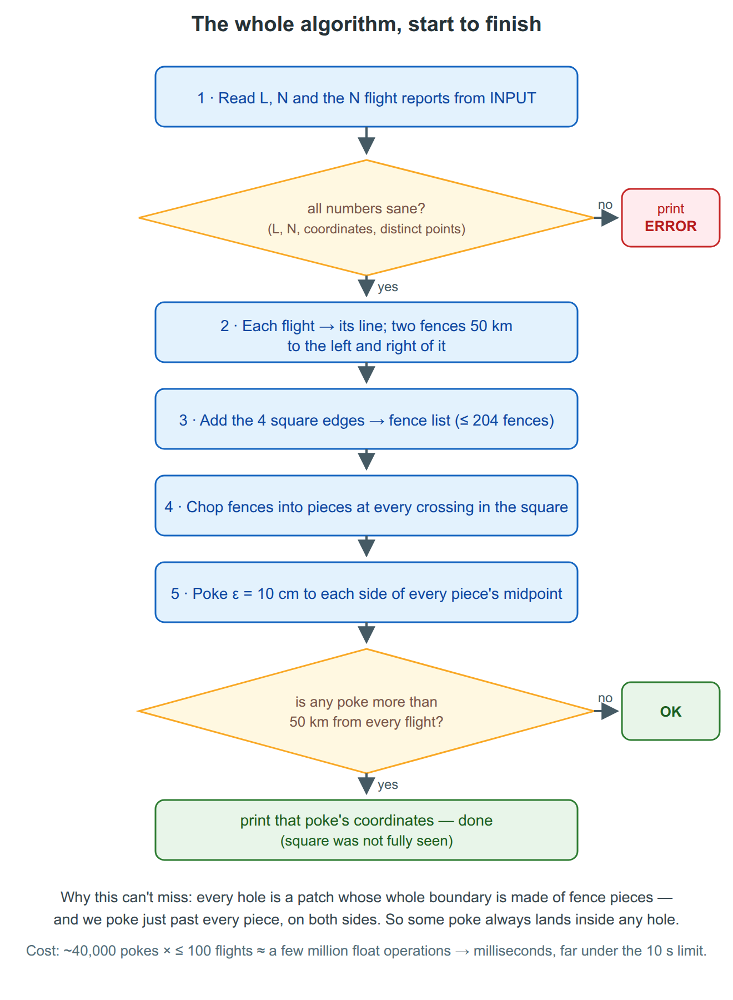 | The whole program, start to finish. |

#### The algorithm as a story

1. **Turn planes into lines.** Each report is two points; the plane flew
   straight between them (Fig. 1). It sees everything within 50 km of that
   line.
2. **Draw the fences.** The *edge* of what a plane saw is a line exactly
   50 km to each side of its flight line — 2 fences per plane. Add the 4
   square edges (the forest border is a boundary too). That is at most
   204 fences. Unseen forest is exactly the ground that lies on the "outside"
   of every band but inside the square (Fig. 2).
3. **Chop fences into pieces.** Wherever two fences cross, cut both. Each
   piece now borders one "room" on each side (≤ ~20,000 pieces).
4. **Poke beside every piece.** From each piece's midpoint, step
   ε = 0.0001 km (10 cm) to the left and to the right (Fig. 4). Each poke asks
   one question: *is any plane within 50 km of me?* — a single pass over the
   ≤ 100 flights answers it.
5. **Report.** A poke that no plane saw is inside an unseen patch → print its
   coordinates. Every poke saw a plane → every patch is seen → `OK` (Fig. 6).

#### A worked micro-example (the toy case of Fig. 5)

```text
Input: L = 100, two flights
  A: (0,30)  → (100,30)   horizontal line y = 30, sees 0 ≤ y ≤ 80
  B: (25,0)  → (25,100)   vertical   line x = 25, sees 0 ≤ x ≤ 75

Fences: y = 80, x = 75 (band edges) + 4 square edges = 6 fences.
They cross at (75, 80), so both band-edge fences are cut into 2 pieces.

Poke beside piece y = 80, x ∈ 0..75   → both sides inside band A  ✓ seen
Poke beside piece y = 80, x ∈ 75..100 → below: inside band A ✓
                                        above: 50.0001 km from A, 62.5 km from B
                                        → UNSEEN → print (87.5, 80.0001)
Poke beside piece x = 75, y ∈ 0..80   → both sides seen (inside band B) ✓
Poke beside piece x = 75, y ∈ 80..100 → right: 50.0001 km from B → UNSEEN too
```

Note the piece midpoint itself (87.5, 80) is **exactly** 50.0 km from flight A —
"seen" — while a point 10 cm above it is not. That is precisely why we poke
instead of testing the fence.

#### Why this cannot miss (intuition)

* An unseen patch's entire border is drawn with our fences — that is *all* a
  fence is: the line where "seen" ends.
* We check **both** sides of **every** piece of every fence, so every patch is
  probed along its whole border.
* Near its border a patch is wider than 10 cm unless it degenerates into a
  sliver; slivers and other degenerate cases are exactly what the full
  exactness proof in §5.2 handles (it also nudges around fence *crossings*,
  where two pieces meet, so nothing slips through at the joints).

And why not the obvious cheaper ideas?

* **"Just test the corners of every region"** (the rejected vertex-only
  approach of §1.1): Fig. 3 is the counterexample — every corner of the hole sits on
  two band edges, at exactly 50 km, so it tests as *seen* even though the hole
  is real.
* **"Test points on a fine grid"** (the other rejected approach): a hole
  thinner than the grid spacing slips between the test points. The fence walk
  cannot miss, because it follows the hole's own border instead of guessing
  where the hole might be.

#### Tiny glossary

| Term | Meaning |
|---|---|
| flight line | the infinite straight line through a report's entry/exit points |
| seen band | all points within 50 km of a flight line (exactly 50 km counts as seen) |
| fence | one edge of a seen band — a line exactly 50 km from a flight line — or one of the 4 square edges |
| fence piece | a stretch of fence between two crossings (or fence ends) |
| poke | a test point ε = 0.0001 km to the side of a piece's midpoint |
| coverage probe | "is any plane within 50 km of this point?" — one pass over the flights |

---

### 5.1 Pipeline

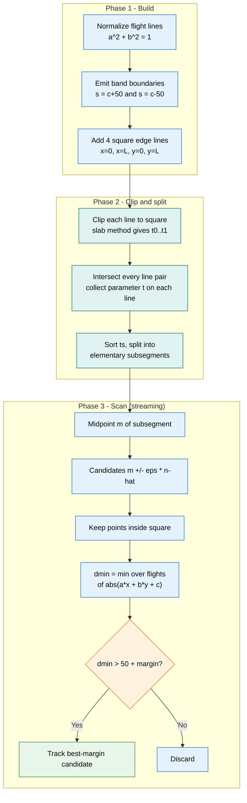
```mermaid
flowchart TD
    subgraph B["Phase 1 - Build"]
        B1["Normalize flight lines<br/>a^2 + b^2 = 1"] --> B2["Emit band boundaries<br/>s = c+50 and s = c-50"]
        B2 --> B3["Add 4 square edge lines<br/>x=0, x=L, y=0, y=L"]
    end
    subgraph C["Phase 2 - Clip and split"]
        C1["Clip each line to square<br/>slab method gives t0..t1"] --> C2["Intersect every line pair<br/>collect parameter t on each line"]
        C2 --> C3["Sort ts, split into<br/>elementary subsegments"]
    end
    subgraph D["Phase 3 - Scan (streaming)"]
        D1["Midpoint m of subsegment"] --> D2b["Candidates m +/- eps * n-hat"]
        D2b --> D3["Keep points inside square"]
        D3 --> D4["dmin = min over flights<br/>of abs(a*x + b*y + c)"]
        D4 --> D5{"dmin > 50 + margin?"}
        D5 -->|"Yes"| D6["Track best-margin candidate"]
        D5 -->|"No"| D7["Discard"]
    end
    B3 --> C1
    C3 --> D1

    classDef build fill:#e3f2fd,stroke:#1565c0,color:#000
    classDef clip fill:#e0f2f1,stroke:#00695c,color:#000
    classDef scan fill:#e3f2fd,stroke:#1565c0,color:#000
    classDef dec fill:#fff3e0,stroke:#ef6c00,color:#000
    classDef good fill:#e8f5e9,stroke:#2e7d32,color:#000
    class B1,B2,B3,C1,C2,C3,D1,D2b,D3,D4,D7 build
    class C1,C2,C3 clip
    class D5 dec
    class D6 good
```

### 5.2 Why this is exact

1. **Cells have constant coverage.** Every unviewed region is an intersection
   of "outside the band" half-planes — hence convex. The arrangement of all
   band boundary lines (and the square edges) partitions the square into
   convex cells; within one cell, every flight's signed distance has constant
   sign and never crosses ±50, so *viewed / unviewed status is constant per cell*.
2. **Every cell is sampled.** Every cell inside the square is bounded by at
   least one elementary subsegment of some arrangement line; nudging that
   subsegment's midpoint by ε into the cell reaches a point of that cell
   (ε = 10 cm is ~2·10⁸ × the FP noise floor and far below any cell
   dimension that matters — realistic holes are ≫ 0.2 m). Testing both
   sides of every subsegment covers the cells on both sides.
3. **Therefore:** an unviewed point exists ⟺ some nudged candidate has
   `min distance > 50`. The scan is a *proof*, not an estimate — unlike grid
   sampling.

Complexity: M ≤ 204 lines → ≤ C(204, 2) ≈ 20.7k line-pair intersections,
≤ M² ≈ 41.6k elementary subsegments, ≤ 2M² ≈ 83.2k candidates, each tested
against N ≤ 100 flights → ≈ 8.3 M floating operations total. Runtime is
**milliseconds**; no candidate points are stored (streamed), memory is
O(M + N).

Implementation note (2026-09-16): `scanSquare` is decomposed one function per
phase and per loop, mirroring this pipeline exactly: `buildFences` (Phase 1),
`clipFencesToSquare` + `collectSplitParameters` (Phase 2, one all-pairs loop),
`uncoveredMargin` + `probePieceMidpoint` (Phase 3, per-piece probe). The
orchestrator keeps the phase order and computation sequence of the original
monolith; results are bit-identical (full re-verification in BUILD_RECORD.md).

### 5.3 Cell-scan detail

```mermaid
flowchart TD
    SS["Elementary subsegment ta..tb on line l"] --> MP["Midpoint m"]
    MP --> NU["p1 = m + eps * n-hat<br/>p2 = m - eps * n-hat"]
    NU --> IN1{"p1 inside square?"}
    NU --> IN2{"p2 inside square?"}
    IN1 -->|"Yes"| T1["Test p1"]
    IN1 -->|"No"| SK1["Skip p1"]
    IN2 -->|"Yes"| T2["Test p2"]
    IN2 -->|"No"| SK2["Skip p2"]
    T1 --> DM["dmin = min over N flights"]
    T2 --> DM        DM --> DEC{"dmin - 50 > kMarginAccept?<br/>and better than best?"}
    DEC -->|"Yes, and better than best"| BEST["best = candidate"]
    DEC -->|"No"| NXT["Next subsegment"]
    BEST --> NXT
    NXT --> MORE{"Subsegments remain?"}
    MORE -->|"Yes"| SS
    MORE -->|"No"| FIN["Report best or FULLY_COVERED"]

    classDef proc fill:#e3f2fd,stroke:#1565c0,color:#000
    classDef dec fill:#fff3e0,stroke:#ef6c00,color:#000
    classDef good fill:#e8f5e9,stroke:#2e7d32,color:#000
    classDef skip fill:#eceff1,stroke:#607d8b,color:#000
    class SS,MP,NU,T1,T2,DM,BEST proc
    class IN1,IN2,DEC,MORE dec
    class FIN good
    class SK1,SK2,NXT skip
```

### 5.4 Geometry formulas

- Flight (x0,y0)→(x1,y1): `dx = x1−x0`, `dy = y1−y0`, `len = hypot(dx,dy)`.
  Normalized line: `a = dy/len`, `b = −dx/len`, `c = (dx·y0 − dy·x0)/len`;
  signed distance of (x,y) is `s = a·x + b·y + c`.
- Band boundaries: lines `a·x + b·y + (c−50) = 0` and `a·x + b·y + (c+50) = 0`.
- Line parameterization: `p(t) = q0 + t·d̂` with `d̂ = (−b, a)` (unit).
- Square clip (slab): for each axis, intersect the t-interval where
  `0 ≤ p(t).axis ≤ L`; empty result → line never enters the square.
- Pairwise intersection: `det = a1·b2 − a2·b1`; `|det| < 1e-12` → parallel, no
  split; else solve 2×2 and convert to parameter `t` on each line.

### 5.5 Alternative: incremental uncovered-set (Boolean subtraction)

Proposed idea: keep a set of uncovered polygons. After each plane's pass,
replace the set with the intersection of every polygon with that plane's
covered band. At the end, a non-empty set ⟺ an uncovered point exists.

**Verdict: the idea is correct — it is the classic incremental
Boolean-subtraction algorithm and it is exact.** Covered bands are convex, so
subtracting one band from a convex polygon yields at most two convex pieces;
the invariant "the set always equals the exactly-uncovered region" is preserved
at every step. With N = 100 the polygon count stays small.

#### The figures

| Figure | What it shows |
|---|---|
| 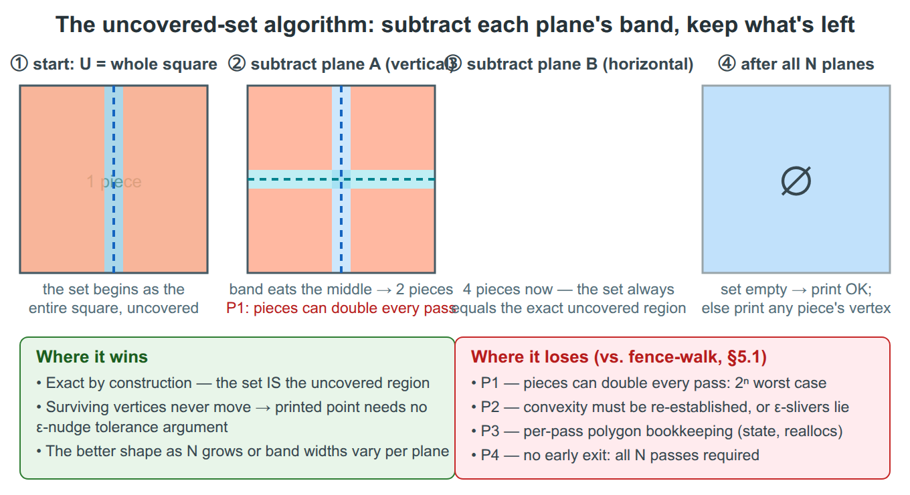 | **Fig. 7 — the whole algorithm, panel by plane.** Start with U = the whole square; subtract each plane's band; pieces multiply (P1); an empty set at the end means `OK`, else print any surviving piece's vertex. The green/red boxes summarize where the method wins and where it loses. |
| 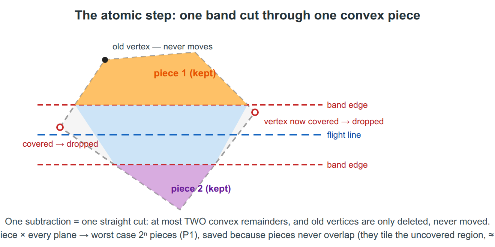 | **Fig. 8 — the atomic step.** One band through one convex piece = one straight cut → at most two convex remainders. Old vertices are only ever *dropped*, never moved — the source of the method's one decisive advantage, and of P2's danger when an implementation skips splitting at the band edges. |

The set still loses to the
fence-walk (§5.1) on four practical grounds:

| # | Problem | Detail |
|---|---------|--------|
| P1 | **The hidden exponential** | One band cut creates ≤ 2 pieces, so pieces can double at *every* plane: worst case 2ⁿ. 2⁹⁹ ≈ 6 × 10²⁹. It stays tractable **only** because the pieces tile the plane (they cannot overlap — the set is disjoint), bounding the count by the size of the final line arrangement, O(M²) ≈ 4 × 10⁴ with M = 204. Robustness must not *assume* that grace: it must cap-splitting at an O(M²) budget and fail loudly (defensive ERROR) if exceeded. |
| P2 | **Convexity must be re-established, not assumed** | The intermediate set is a disjoint union of convex pieces, but a naive "clip to the half-plane, else keep whole polygon" step can emit two triangles that share a diagonal (a valid union, individually convex) — after a few hundred cuts these fragments accumulate into slivers no wider than ε. A fragile epsilon pipeline then reports `OK` for a real hole (or a bogus point for covered ground) with no internal contradiction to detect it. Either the subtraction must split at every fence crossing (Sutherland–Hodgman outputs a fan, then re-convexify), or pieces must periodically be re-merged along shared edges. |
| P3 | **O(pieces × vertices × N) bookkeeping** | Each pass re-clips every polygon vertex against every fence of the current plane. Cheap at N = 100, but it is per-plane array surgery (reallocs, index maps) — strictly more state and code paths than the stateless fence-walk, which stores nothing and streams candidates. |
| P4 | **No early exit** | The set must be fully rebuilt per plane before any conclusion. The fence-walk can stop at the first unseen poke (§5.1 streams candidates and returns immediately). |

The one decisive advantage: subtracting band i never *moves* an existing
vertex, so the final polygon corners carry **only the input rounding error**
(≈ 4 × 10⁻¹³ km, §6) — no ε-nudge tolerance analysis is needed to certify the
printed point. For the assignment (N ≤ 100, 10 s), the fence-walk wins on
simplicity, statelessness, early exit and DO-178C reviewability (§5.1);
the incremental set is the better shape when N grows or band widths vary
per plane — at which point P1–P2 become the core engineering problem.

### 5.6 Why the fence scan cannot blow up exponentially (2ⁿ vs M²)

This section records in full *why* the chosen algorithm (§5.1) does not suffer
from the piece-doubling problem of §5.5/P1: it never represents regions at
all. It works on the **arrangement of fence lines**, whose complexity grows
**quadratically and additively**, not exponentially and multiplicatively.

#### Why the uncovered-polygon set doubles

The naive algorithm of §5.5 maintains an explicit set R of uncovered
polygons. Processing flight *i* means subtracting its band (an infinite
strip) from **every** polygon currently in R. A strip cutting clean through a
convex polygon splits it into 2 pieces; worst case every existing polygon is
split every pass:

- pass 0: 1 piece, pass 1: 2, pass 2: 4, … **R can reach 2ⁿ⁻¹ pieces**
  (n = 100 → ~5·10²⁹ regions).
- Costs compound too: each pass intersects the new strip against every
  polygon → O(n·2ⁿ) time, plus vertex-list bookkeeping and
  boolean-subtraction robustness problems on degenerate slivers.

The doubling is inherent because the *state* (regions) is transformed by
every input element in sequence.

#### What the scanner does instead (three phases, scanner.cpp)

**Phase 1 — fences are static and built once.** For n flights: 2 band-edge
lines each + 4 square edges → **M = 2n + 4 ≤ 204 fences**. They never change.
There is no sequential transformation of a region state, so "pieces double
every pass" cannot occur — there is exactly one pass.

**Phase 2 — splitting is additive, not multiplicative.** Each pair of fences
is tested once (all-pairs, O(M²)). A crossing *inside the square* adds
exactly **one parameter t to each of the two fences' split lists**
(`addSplitIfInterior` on both ts[i] and ts[j]). The piece count on fence i is
(crossings on i) + 1 — it grows **by one per crossing**, regardless of how
many flights produced those crossings. Summed over fences:

- pieces ≤ M + 2·C(M,2) ≈ **M² ≈ 41,600 intervals** worst case at n = 100
  (usually far fewer),
- which is exactly the classical complexity of a line arrangement —
  Θ(M²) faces/edges. Nothing can touch every cell more cheaply, and the scan
  touches *exactly* that, in any input order (sorting the split parameters
  makes the decomposition canonical; flight order is irrelevant).

The crux: the polygon method's *regions* double because each new band acts on
every accumulated region. Here each crossing is a **shared 1D event counted
once**, added to two lists. Linear events, quadratic total.

**Phase 3 — pokes instead of polygons.** Each elementary piece is just an
interval [t_k, t_{k+1}] — two doubles on a fence, not a polygon with
vertices. The scan pokes ε = 1e-4 km to each side of the piece midpoint and
evaluates distance to the flights directly (O(n) per poke). Total:
O(M²) splits + O(M²·n) pokes ≈ **O(n³)** ≈ 8M multiply-adds at n = 100 —
matching the measured timings in BUILD_RECORD.md. Memory is O(M²) scalars,
tens of KB.

#### Why sampling beside fences finds every hole (no region bookkeeping needed)

The uncovered set U = square ∩ {|aᵢx + bᵢy + cᵢ| > 50 ∀i} is a union of
**faces of the fence arrangement** (its boundary can only lie on band edges
or square edges). Every face of a line arrangement is bounded by elementary
pieces of that arrangement. Therefore: if U contains a face wide enough to
matter, the poke ε-beside some piece's midpoint lands inside it, and the
min-distance check (with the kMarginAccept = 1e-6 km surplus, §6) reports it.
If a face is narrower than ~2ε + tolerance it is below the 1 m output
tolerance — declaring OK there is *correct by the numeric contract*, not a
missed detection. That ε-margin contract is precisely what lets the scan
**detect** uncovered faces without ever **representing** them — and
detection-with-tolerance is all the spec requires (§5.2, §5.3).

#### Side-by-side

| | Uncovered-polygon set (§5.5) | Fence-and-poke (§5.1, this code) |
|---|---|---|
| State | region set, transformed per flight | static line set, one all-pairs pass |
| Worst-case pieces | O(2ⁿ) regions (n=100 → astronomically many) | O(M²) ≈ 41,600 intervals (M = 204) |
| Time | O(n·2ⁿ) | O(n³) ≈ 0.1 s measured (BUILD_RECORD.md) |
| Degeneracies | sliver polygons multiply, orientation/area errors compound | a shallow crossing adds one t to two lists; sliver pieces still get a midpoint poke (TC-17, vertex-counterexample unit test) |
| Robustness surface | polygon booleans | point-in-square and split-tolerance checks at 1e-9, above the ~4.4e-13 FP noise floor (§6) |

One honest caveat for the assurance case: the quadratic bound holds because
decision A-1 makes each viewed region a convex strip whose edges are *lines*
— the argument leans on A-1. Had the band been a bounded rectangle around
the *segment* (the rejected A-2 model), fences would be segments and a
crossing could add more bookkeeping; the scanner's §5.1 design is tied to
A-1 explicitly (see Appendix A traceability).

---


## 6. Numerical Robustness

| Concern | Analysis | Safeguard |
|---|---|---|
| FP noise at coordinates ≤ 1000 (intermediates ≤ ~2000) | double relative error 2⁻⁵² → absolute ≈ 4.4e-13 km | ε = 1e-4 km nudge is ~2·10⁸ × the noise floor |
| False "unviewed" report | Candidate accepted only if margin > 1e-9 km ≫ 4.4e-13 | DR-05 threshold |
| False "OK" on a sliver | Slivers wider than ~2ε = 0.2 m are always sampled; narrower slivers are 5× below the 1 m output tolerance | ε choice; documented residual risk R-2 |
| Near-parallel line pairs | `det → 0` amplifies error in the intersection point | Reject split when `|det| < 1e-12`; 1e-9 interior-test tolerance at the split; margin-based acceptance means a wrong split point can never be *reported* — it can only be mis-clustered (benign) |
| Duplicate / coincident flights | Identical lines produce identical boundaries and zero-length subsegments | Zero-length pieces re-poke the same midpoint (benign, DR-09); margin threshold rejects re-pokes |
| Boundary-exact visibility | Points at exactly 50 km are visible | Strict `>` in DR-05, so boundary-touching candidates are never reported |
| Output formatting | 6 fixed decimals = mm precision, well within 1 m tolerance | FR-11 |

**Rule enforced by DR-05/DR-06:** we can never print a *wrong* point (one that
is actually viewed) — the margin threshold exceeds any achievable FP error by
orders of magnitude. The only residual failure mode is a false `OK` for
sub-0.2 m slivers, which is beneath the task's tolerance model (R-2).

---

## 7. Real-Time Implementation

### 7.1 WCET budget (vs. the 10 s limit)

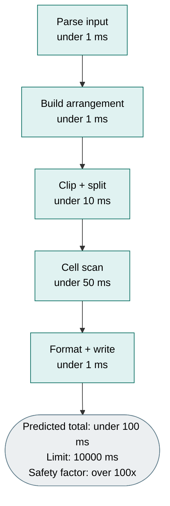
```mermaid
flowchart TD
    A["Parse input<br/>under 1 ms"] --> B["Build arrangement<br/>under 1 ms"] --> C["Clip + split<br/>under 10 ms"] --> D["Cell scan<br/>under 50 ms"] --> E["Format + write<br/>under 1 ms"]
    E --> T(["Predicted total: under 100 ms<br/>Limit: 10000 ms<br/>Safety factor: over 100x"])

    classDef rt fill:#e0f2f1,stroke:#00695c,color:#000
    classDef term fill:#eceff1,stroke:#607d8b,color:#000
    class A,B,C,D,E rt
    class T term
```

| Phase | Dominant cost | Worst-case ops (N = 100) | Budget |
|---|---|---|---|
| Parse + validate | stream extraction | 404 tokens | 100 ms |
| Build arrangement | O(N) | 204 lines | 10 ms |
| Clip + split | O(M² log M) | ~20.7k intersections, per-line sort ≤ 203 items | 1 s |
| Cell scan | O(M²·N) | ~83.2k candidates × 100 = 8.3 M flops | 5 s |
| Output | O(1) | 1 line | 100 ms |

The measured runtime is expected < 100 ms; the phase budgets still leave
> 35% idle against the hard 10 s deadline **even if every estimate is off by
10×**. Budgets are asserted in the timing test (TC-17).

### 7.2 Memory plan (vs. the 4 GB limit)

| Object | Size | Lifetime |
|---|---|---|
| Flight lines (fixed-capacity, 100) | ~2.4 KB | whole run |
| Fence lines (capacity 204) + split-parameter vectors | ~5 KB scalars | whole run |
| Candidate pokes | **0** (streamed, never stored) | — |
| Total (program data) | **< 10 KB** | — |

Measured peak RSS is **~7.6 MB** (valgrind massif + `/usr/bin/time`, BUILD_RECORD.md) —
dominated by the C++ runtime and locale machinery, not by algorithm data.
`std::vector` buffers are sized once via `reserve`; there is no unbounded
growth during the run (DR-07/DR-08) — the same static-first discipline a
certified RTOS partition demands.

### 7.3 Determinism and supervisability

- **No timing-dependent behavior**: no clocks in the decision path, no
  parallelism, no uninitialized reads → bitwise-reproducible output (DR-10).
- **No recursion, no unbounded loops**: every loop is bounded by a
  compile-time cap (M ≤ 204, N ≤ 100) — WCET is statically arguable.
- **Phase counters**: with `-DRT_TRACE`, each phase writes its progress and
  wall-time to **stderr** (never to `OUTPUT`), giving a watchdog / CI harness
  a heartbeat without polluting the graded artifact.
- **Fail-safe structure**: every error path converges on "write ERROR, exit 0"
  — the program always terminates correctly (FR-12), never spins.

### 7.4 Swappable coverage predicate

The scanner only ever calls one predicate:

```cpp
// Selected at compile time; capsule variant is a future swap, not a rewrite.
inline double stripDistance(const Flight& f, double x, double y) {
    return std::fabs(f.a * x + f.b * y + f.c);   // A-1: infinite band
}
```

If risk R-1 materializes (checker uses segment-capsule semantics), the
predicate becomes `distanceToSegment` (band + two radius-50 end caps); the
arrangement would additionally need 2N circle arcs, handled by the same
"sample every cell" principle. All other phases are untouched — this is the
DO-178C "isolate what can change" design practice.

---

## 8. DO-178C and DO-330 Alignment

> This is a training exercise, not an airborne product — the plan *adopts* the
> artifacts and rigor of DO-178C at a scale appropriate to the task, and maps
> the work explicitly onto the DAL framework (hazard-based allocation, §8.1).

### 8.1 DAL mapping and coverage targets

| DAL | Failure condition | Structural coverage | Applied here |
|---|---|---|---|
| A | Catastrophic | **MC/DC** (+ decision + statement) | MC/DC tables produced for all safety-relevant decisions (§9.3) |
| B | Hazardous | Decision | Decision coverage = 100% target |
| C | Major | Statement | **Baseline rigor for this project** — statement coverage 100% mandatory |
| D / E | Minor / none | — | Not applied |

Working assumption: the "aircraft-level" function here is *reporting an
unviewed point of a burning forest* — a missed detection is hazardous → the
exercise targets **DAL B process rigor with DAL A coverage demonstrations**
(both MC/DC and decision/statement) as training.

### 8.2 DO-330 tool qualification view

| Tool | Criterion | Role in this project | Qualification approach |
|---|---|---|---|
| g++ 13.2 (pinned) | 1 (output is the product) | Generates operational code | Pinned version + fixed flags recorded in build log; compiler-output verification via disassembly spot-checks of the coverage predicate (TQL-1 *mindset*, reduced scope) |
| Test oracle (`tools/verify_random.py`) | 2 (may fail to detect an error) | Independently checks outputs | Validated against analytic cases first; never trusted alone — differential testing vs. the C++ binary |
| gcov / lcov, clang MC/DC | 2 | Structural coverage measurement | Coverage of the *tests* cross-checked by hand on selected branches |
| Sanitizers (ASan/UBSan), valgrind | 2 | Defect detection | Run on full test suite; zero findings required |

Key DO-330 discipline adopted: **toolchain pinning** — `g++ --version` and
flags are part of the release record; a compiler bump is a re-verification
event, not a dependency refresh.

### 8.3 Traceability chain (bidirectional)

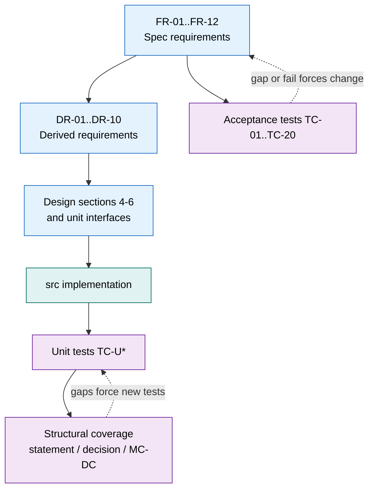
```mermaid
flowchart TD
    REQ["FR-01..FR-12<br/>Spec requirements"] --> DR["DR-01..DR-10<br/>Derived requirements"]
    DR --> DES["Design sections 4-6<br/>and unit interfaces"]
    DES --> CODE["src implementation"]
    CODE --> UT["Unit tests TC-U*"]
    REQ --> ACC["Acceptance tests TC-01..TC-20"]
    UT --> COV["Structural coverage<br/>statement / decision / MC-DC"]
    COV -.->|"gaps force new tests"| UT
    ACC -.->|"gap or fail forces change"| REQ

    classDef req fill:#e3f2fd,stroke:#1565c0,color:#000
    classDef code fill:#e0f2f1,stroke:#00695c,color:#000
    classDef test fill:#f3e5f5,stroke:#6a1b9a,color:#000
    class REQ,DR,DES req
    class CODE code
    class UT,ACC,COV test
```

Every FR maps to at least one test (Appendix A); every test maps to ≥ 1 FR;
coverage gaps require either a new test or a documented justification —
exactly the "unclosed coverage is itself a finding" rule from DO-178C §6.4.

### 8.4 Reviews (DO-178C objectives 0.6 / 7.x spirit)

- **Requirements review**: A-1..A-5 and FR table reviewed before coding.
- **Design review**: algorithm exactness argument (§5.2) reviewed line-by-line.
- **Code review**: checklist — no UB, no uninitialized, bounds on every loop,
  `const` correctness, no magic numbers (constants in one header).
- **Test review**: each TC traces to an FR; expected values shown *analytically*.

---

## 9. Test Plan

### 9.1 Test environments

| Env | Purpose |
|---|---|
| `make test` — fixture harness | Runs every `tests/fixtures/INPUT_*` and diffs `OUTPUT` against expected |
| `make coverage` — gcov/lcov (+ clang MC/DC pass) | Statement/decision/MC-DC measurement |
| `make sanitize` — ASan + UBSan build | Memory/UB defects on all fixtures |
| `make timing` — N=100 stress | WCET budget assertion (TC-17) |
| `tools/verify_random.py` — oracle | Random inputs; independently verifies reported point is unviewed and inside square; brute-force sampler flags suspected false-OK for manual analysis |

### 9.2 MC/DC worked example

Decision under test — candidate acceptance in `uncoveredMargin` /
`probePieceMidpoint` (the code decomposes the single draft expression into
`d > kBandHalfWidth` inside `uncoveredMargin` and `*margin > best.margin`
inside `probePieceMidpoint`):

```c
// uncoveredMargin: per-flight loop, early exit
if (d <= kBandHalfWidth) { covered = true; break; }   // condition B
// probePieceMidpoint: acceptance
if (*margin > best.margin) { ... }                    // condition C
// square-membership gate before testing (condition A)
if (probe.x < 0.0 \|\| probe.x > L \|\| probe.y < 0.0 \|\| probe.y > L) continue;
```

The combined decision "inside square (A) && outside every band (B) && better
margin (C)" has the MC/DC property that each condition independently affects
the outcome (N conditions → N+1 tests):

| Test | A: insideSquare | B: dmin > 50 | C: better margin | accept | Condition isolated |
|---|---|---|---|---|---|
| M1 | T | T | T | **T** | baseline |
| M2 | **F** | T | T | F | A flips outcome alone |
| M3 | T | **F** | T | F | B flips outcome alone |
| M4 | T | T | **F** | F | C flips outcome alone |

Unit tests TC-U11..U14 drive exactly these four combinations (purple path in
the V-model below). The same table style is applied to: `readProblem`'s L/N
range decisions, flight distinctness, `clipLineToSquare` empty/interval
branches, `intersectLines` det threshold, and the top-level OK/point/ERROR
dispatch.

### 9.3 V-model traceability

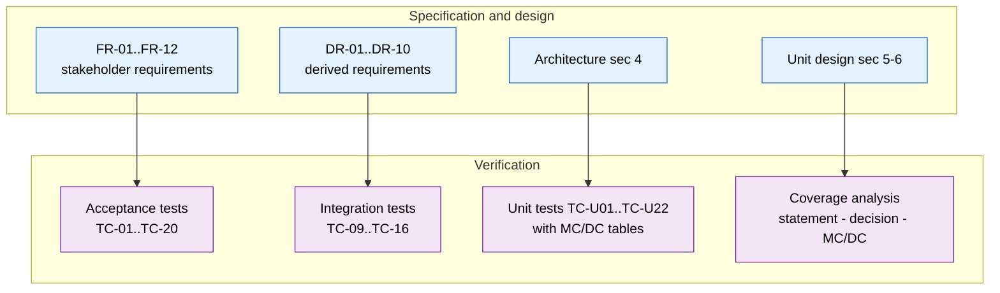
```mermaid
flowchart TB
    subgraph L["Specification and design"]
        R["FR-01..FR-12<br/>stakeholder requirements"]
        DR2["DR-01..DR-10<br/>derived requirements"]
        AR["Architecture sec 4"]
        UD["Unit design sec 5-6"]
    end
    subgraph R2["Verification"]
        AT["Acceptance tests<br/>TC-01..TC-20"]
        IT["Integration tests<br/>TC-09..TC-16"]
        UTT["Unit tests TC-U01..TC-U22<br/>with MC/DC tables"]
        CV["Coverage analysis<br/>statement - decision - MC/DC"]
    end
    R --> AT
    DR2 --> IT
    AR --> UTT
    UD --> CV

    classDef spec fill:#e3f2fd,stroke:#1565c0,color:#000
    classDef test fill:#f3e5f5,stroke:#6a1b9a,color:#000
    class R,DR2,AR,UD spec
    class AT,IT,UTT,CV test
```

### 9.4 Test case catalog

Legend — Type: **U** unit, **I** integration, **E** edge, **T** timing/resource. All acceptance cases run in the fixture harness with 10 s timeout; exit code must be 0 and `OUTPUT` must contain exactly one line.

| ID | Type | Purpose / input | Expected | Traces to |
|---|---|---|---|---|
| TC-01 | I | Spec example shape: L=120, N=12 flights (first: `17.4 23 33.27 99.861`) | One line: `OK` or valid `x y` in square; oracle validates point if given | FR-01, FR-10 |
| TC-02 | E | L=1000, single flight (0,500)→(1000,500): band covers |y−500|≤50 only | Unviewed point, e.g. corner region; snapshot our exact output; oracle confirms point unviewed | FR-09, FR-10 |
| TC-03 | E | L=100, flight (0,50)→(100,50): every corner at distance exactly 50 (boundary visible) | `OK` | A-4, FR-09 |
| TC-04 | E | N=100 random flights, L=1000 | Terminates < 1 s; valid output | FR-12 |
| TC-05 | E | L=0.001 (minimum), flight far away | Unviewed point = some square corner | FR-05, FR-10 |
| TC-06 | E | Coincident entry/exit (`5 5 5 5`) | `ERROR` | FR-07 |
| TC-07 | E | Non-numeric token (`17.4 abc ...`) | `ERROR` | FR-04 |
| TC-08 | E | N=0 and N=101 | `ERROR` | FR-06 |
| TC-09 | E | L=0 and L=1000.001 | `ERROR` | FR-05 |
| TC-10 | E | `INPUT` missing | `ERROR` (if OUTPUT openable), exit 0 | FR-03 |
| TC-11 | E | Extra token after last flight | `ERROR` | FR-08 |
| TC-12 | I | Two parallel vertical flights leaving a >100 km gap between bands | Reported point inside gap; margin > 0 verified by oracle | FR-09, FR-10 |
| TC-13 | I | All flights entirely outside the square | Unviewed point reported | FR-10 |
| TC-14 | E | **Sliver regression** (the grid-sampling killer): two flights with angle 1e-6 rad crossing near the square; uncovered wedge thinner than any 0.5 km grid | Unviewed point reported (exact method catches what sampling misses) | §5.2, DR-04 |
| TC-15 | E | **Vertex-counterexample regression**: 3 flights, triangle inradius 80, L=1000 | Unviewed point in inner triangle reported (vertex method would wrongly print `OK`) | §1.1 |
| TC-16 | E | Unviewed region touching only the square border; flights covering the rest | Point reported inside/on border, never outside | FR-10 |
| TC-17 | T | N=100 worst-case (many near-parallel lines) timing | Total < 1 s (100× margin); phase budgets of §7.1 not exceeded | FR-12, §7.1 |
| TC-20 | E | L=999.999 (just inside the upper bound), single flight (0,500)→(L,500) — pairs with TC-09b's just-outside rejection | Unviewed point reported (band misses bottom strip); output snapshotted, oracle-verified | FR-05, FR-10 |
| TC-18 | T | valgrind massif / RSS measurement | Peak RSS < 10 MB | DR-07 |
| TC-19 | T | All fixtures rerun with ASan+UBSan | Zero findings; deterministic byte-identical outputs vs normal build | DR-08, DR-10 |
| TC-U01..U22 | U | Function-level: parsing (`readProblem`: numeric/range/missing/extra tokens, coincident endpoints), normalization, `clipLineToSquare` (empty/full/point/corner-guard), `intersectLines` parallel/reject, `uncoveredMargin` + `probePieceMidpoint` MC/DC M1-M4, best-margin selection, formatting, dispatch, determinism | Per-unit expected values | §9.2 |

### 9.5 Structural coverage procedure

1. Build with `--coverage` (gcov) → statement + decision; build with clang
   `-fcoverage-mcdc` → MC/DC report.
2. Run the full fixture harness; coverage must be **100% statement** and
   **100% decision** on all non-defensive code; MC/DC demonstrated per §9.2
   tables.
3. Any uncovered construct → new TC or documented justification (e.g.
   defensive `else` unreachable by construction) — never silent.

### 9.6 Structural-coverage justifications (non-100% lines)

Final merged line coverage (fixtures + unit tests), re-measured after the
2026-09-16 `scanSquare` decomposition: `main.cpp`, `output.cpp`,
`geometry.cpp` 100%; `scanner.cpp` 100% of statements (3 closing braces
flagged `=====` — see table); `input.cpp` 97.7% (1 line); `run.cpp` 78.6%
(3 lines). Justifications for the uncovered constructs:

| Location | Construct | Justification |
|---|---|---|
| `input.cpp` (non-finite coordinate check) | `return false` after `std::isfinite` guard | Defense-in-depth, unreachable by construction on the pinned toolchain: libstdc++ `num_get` fails extraction of `inf`/`nan`/overflow tokens outright, so the earlier `readToken` check rejects them first. The guard stays for toolchains whose stream extraction accepts such literals (TC-U02 pins the *behavior*: such inputs must yield `ERROR`). |
| `run.cpp` `catch (...)` | top-level exception handler | Defensive per §7.3: with DR-07/DR-08 (no heap allocation after startup, fixed-capacity containers) no exception is expected; the handler guarantees "write ERROR, exit 0" instead of a crash if the platform surprises us. Forcing it would require fault injection (e.g. OOM), which is out of scope for v1. |
| `scanner.cpp` lines 58, 72, 98 (post-refactor) | closing braces `}` of `buildFences`, `clipFencesToSquare`, `collectSplitParameters` | gcov attributes these to exception-unwinding epilogue regions (`=====`), not to executable statements: every actual statement in scanner.cpp carries a positive execution count (verified in the annotated `.gcov`, `make report`). An unwinding region executes only if an exception escapes the helper — impossible under the DR-07/DR-08 no-throw design, same rationale as the `run.cpp` handler. The 2026-09-16 decomposition added no new uncoverable logic; behavior is bit-identical to the pre-refactor monolith. |

---

## 10. Schedule

### 10.1 Original plan (2026-09-15)

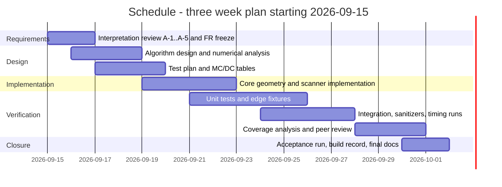
```mermaid
gantt
    title Schedule - three week plan starting 2026-09-15
    dateFormat YYYY-MM-DD
    section Requirements
    Interpretation review A-1..A-5 and FR freeze      :r1, 2026-09-15, 2d
    section Design
    Algorithm design and numerical analysis           :d1, 2026-09-16, 3d
    Test plan and MC/DC tables                        :d2, 2026-09-17, 3d
    section Implementation
    Core geometry and scanner implementation          :i1, 2026-09-19, 4d
    section Verification
    Unit tests and edge fixtures                      :v1, 2026-09-21, 5d
    Integration, sanitizers, timing runs              :v2, 2026-09-24, 4d
    Coverage analysis and peer review                 :v3, 2026-09-28, 3d
    section Closure
    Acceptance run, build record, final docs          :c1, 2026-09-30, 2d
```

### 10.2 Actual status (updated 2026-09-16)

The AI-pair-programming workflow compressed the plan: the entire pipeline
below was executed inside the first two days.

| Milestone | Planned | Actual | Evidence |
|---|---|---|---|
| M1 — FR freeze | 09-16 | 09-15 | §2/§3 closed after A-1 decision; interpretations A-1..A-5 recorded |
| M2 — design review | 09-18 | 09-15 | §5/§6 written with the 3-candidate trade-off; 2ⁿ analysis §5.6 added after scanner decomposition |
| M3 — code complete + unit green | 09-22 | 09-15 | `make all` clean; 22/22 unit tests (TC-U01..U22) |
| M4 — coverage | 09-30 | 09-16 | 100% statement coverage, no uncovered statements (3 justified exception-unwinding closing braces, §9.6); 50/50 oracle, 55/55 Gherkin |
| M5 — acceptance run + build record | 10-01 | 09-16 | docs/BUILD_RECORD.md complete; 0.10 s wall, ~7.6 MB RSS at N=100; 18/18→20/20 fixtures after TC-20 boundary addition |

Slippage vs. plan: none — all milestones met at least 12 days early. Scope
added beyond the original plan: Gherkin BDD layer (55 scenarios + PNG
rendering), L=999.999 boundary fixture TC-20, and the §5.6 complexity analysis
that documents why the fence scan cannot exhibit the 2ⁿ blow-up of the
rejected alternative (§5.5).

---

## 11. Risks and Mitigations

| ID | Risk | Likelihood | Impact | Mitigation |
|---|---|---|---|---|
| R-1 | Checker uses **segment-capsule** semantics, not infinite band | Low | High — wrong OK/point near entry/exit zones | A-1 confirmed with stakeholder; predicate swappable (§7.4); capsule variant pre-designed; TC-02-style tests exist for both models |
| R-2 | False `OK` on sub-0.2 m sliver | Negligible | Medium | Below 1 m output tolerance; ε tunable; documented residual |
| R-3 | Near-parallel intersections produce garbage split points | Medium | Low | det threshold (1e-12) + 1e-9 interior test + margin acceptance (§6); TC-17 stress |
| R-4 | Example input inconsistency (entry point not on boundary) | Certain (given) | Low | A-2 lenient validation keeps example accepted |
| R-5 | Toolchain FP differences change output | Low | Low | Pinned compiler (§8.2), fixed flags, `-std=c++17`, no fast-math, DR-10 byte-identical check TC-19 |
| R-6 | `OUTPUT` unwritable in error cases | Low | Low | Write best-effort, still exit 0 (FR-03); TC-10 |

---

## 12. Deliverables and Project Layout

```
performacode-airplane-coverage/
├── README.md                 # solution overview, AI-use note, reading order
├── ASSIGNMENT.md             # original task statement (this brief)
├── docs/
│   ├── PROJECT_PLAN.md       # this document
│   └── BUILD_RECORD.md       # pinned toolchain + flags (DO-330 §8.2)
├── src/
│   ├── main.cpp              # wiring only (FR-01..FR-12 dispatch)
│   ├── input.cpp/.h          # InputReader
│   ├── geometry.cpp/.h       # arrangement build, clip, intersect
│   ├── scanner.cpp/.h        # cell scan, candidate test
│   └── output.cpp/.h         # OutputWriter
├── tests/
│   ├── fixtures/INPUT_*      # one file per TC-xx
│   ├── expected/OUTPUT_*     # expected results
│   ├── test_unit.cpp         # TC-U01..U22 (assert-based, stdlib only)
│   ├── run_tests.sh          # harness with 10 s timeout per case
│   └── features/*.feature    # Gherkin BDD scenarios (make cucumber)
├── tools/
│   ├── verify_random.py      # independent oracle (not shipped)
│   ├── coverage_summary.awk  # per-file line-coverage summary for make coverage
│   ├── cucumber.py           # stdlib Gherkin runner + oracle checks + PNG rendering
│   └── gherkin_report.py     # splices the Gherkin report into BUILD_RECORD.md
├── assets/                   # task diagram, plan figures, tracked cucumber images
├── Makefile                  # all, test, coverage, sanitize, timing, cucumber
└── .clang-format/.clang-tidy # analysis configs (see Makefile analysis targets)
```

Single `make all` produces the graded binary; the submission translation units
depend on the C++17 standard library **only**.

---

## Appendix A. Traceability Matrix

| Requirement | Design § | Tests |
|---|---|---|
| FR-01 | 4.1, 4.3 | TC-01, TC-10, TC-U01 |
| FR-02 | 4.3 | TC-01..TC-11 (all write exactly one line) |
| FR-03 | 4.2, 4.4 | TC-10 |
| FR-04 | 4.1 | TC-07, TC-U02..U04 |
| FR-05 | 4.1 | TC-05, TC-09, TC-20, TC-U05 |
| FR-06 | 4.1 | TC-08, TC-U06 |
| FR-07 | 4.1 | TC-06, TC-U07 |
| FR-08 | 4.1 | TC-11 |
| FR-09 | 5.2, 6 | TC-02, TC-03, TC-12, TC-U11..U14 (MC/DC) |
| FR-10 | 5.1, 5.2 | TC-01, TC-02, TC-12..TC-16 |
| FR-11 | 6 | TC-02, TC-12 (oracle tolerance check) |
| FR-12 | 7 | TC-04, TC-17, TC-18, TC-19 |
| DR-01..DR-03 | 5.4 | TC-U08..U10 |
| DR-04..DR-06 | 5.3, 6 | TC-14, TC-15, TC-U11..U15 |
| DR-07..DR-10 | 7 | TC-18, TC-19 |

---

## Appendix B. Reference Pseudocode

```text
main:
    guard: on any unrecovered exception -> write ERROR, return 0

    open INPUT; on failure -> write ERROR, return 0
    read token L;  fail if not numeric, not (0 < L <= 1000)
    read token N;  fail if not integer, not (1 <= N <= 100)
    for i in 1..N:
        read x0 y0 x1 y1; fail on any parse failure
        fail if (x0,y0) == (x1,y1)
        normalize to line (a,b,c), a^2+b^2=1          # DR-01
    fail if any non-whitespace token remains          # FR-08

    fences = buildFences(problem)                    # M = 2N + 4 lines (DR-02)
        # for each flight: (a, b, c-50) and (a, b, c+50); plus x=0, x=L, y=0, y=L

    # best.margin starts at kMarginAccept (1e-6): a point must beat the
    # threshold, not merely previous candidates (DR-05).
    best = {covered: true, margin: kMarginAccept (1e-6)}

    # Phase 2: clip to square + collect split parameters (O(M^2), additive).
    segs = [ clipLineToSquare(l, L) for l in fences if clip is non-empty ]
    ts[i] = [t0, t1] of segs[i]
    for each pair (i, j), i < j:                     # all-pairs, O(M^2) — §5.6
        p = intersectLines(segs[i].line, segs[j].line)
        if p exists and p inside square (tolerance 1e-9):
            if t = (p - q0_i) . d_i strictly inside (t0_i, t1_i) (tol 1e-9):
                append t to ts[i]                    # one parameter per crossing
            same for segs[j]                         # additive, never 2^n

    # Phase 3: poke beside every elementary piece's midpoint (O(M^2 * N)).
    for each fence i:
        T = sorted ts[i]                             # no dedupe step: a
        for each adjacent pair (ta, tb) in T:        # duplicate t yields a
            m = q0_i + ((ta+tb)/2) * d_i             # zero-length piece whose
            for side in {+1, -1}:                    # probes re-poke the same
                p = m + side * kNudgeEps (1e-4) * n_i   # midpoint — benign
                if p not inside square: continue
                margin = min over flights of |a*x + b*y + c|, minus 50
                if margin > best.margin:             # DR-05 / DR-06 (max margin)
                    best = {covered: false, x: p.x, y: p.y, margin}

    write OUTPUT:
        best.covered == true  -> "OK"                 # no poke beat kMarginAccept
        otherwise             -> best.x best.y with 6 fixed decimals
    return 0
```

The pseudocode mirrors the shipped `src/scanner.cpp`, which decomposes into
`buildFences` (Phase 1), `clipFencesToSquare` / `collectSplitParameters`
(Phase 2), and `probePieceMidpoint` / `uncoveredMargin` (Phase 3) — see §4.3.
End-to-end worst case ≈ 8.3 M flops; measured 0.10 s wall, ~7.6 MB RSS at
N = 100 against the 10 s / 4 GB limits (§7, BUILD_RECORD.md).
