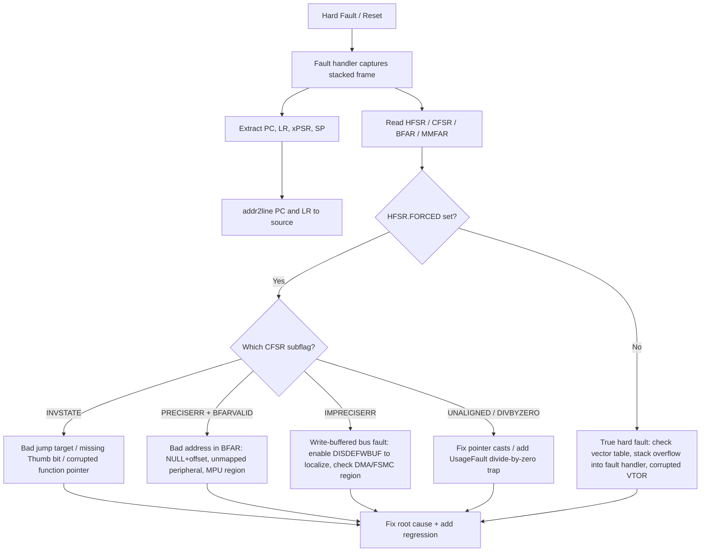

# RTOS Kernel Engineer Interview Preparation

## PerformaCode

Preparing for a Senior RTOS Kernel Engineer position at PerformaCode requires a
specific mix of cross-compilation toolchain internals (GCC, LLVM, Binutils),
linker-script and startup-code fluency, real-time kernel fundamentals
(scheduling, priority inversion, context switching), and DO-178C/DO-330
safety-certification literacy.

Here is a curated set of interview questions — broken down by technical
categories and behavioral alignment — along with strong, professional answers
tailored to this role.

---

## Framing Your Experience

Your background aligns well with PerformaCode's core requirements. Here is how
your experience translates directly into the specific focal areas of the
position:

| Job Requirement | Your Experience Match | Key Talking Point |
|---|---|---|
| Toolchains (GCC, LLVM, Binutils) | Ported Chromium using LLVM (clang-tidy/clang-format integration), Yocto toolchain recipes across multiple architectures. | Emphasize custom toolchain generation, libgcc dependency management, and target sysroot generation in Yocto. |
| RTOS & Kernel Development | 25+ years writing Linux/RTOS drivers (SPI, UART, I2C, USB, LCD), board bring-up, low-latency audio pipelines. | Contrast general Linux kernel drivers with RTOS deterministic execution, interrupt handling, and memory allocation constraints. |
| Safety-Critical / Certifications | Autonomous vehicle control systems at John Deere (auto steer, transmission, engine control). | Pivot your John Deere mission-critical firmware experience to DO-178C concepts (traceability, structural coverage, DO-330 tool qualification). |
| Low-Level Debugging | GDB, JTAG, ITP, kernel/driver debugging at MagicLeap, AMD, and Dojo Five. | Highlight remote debugging across heterogeneous architectures (ARM, x86) and tracing target-side toolchain bugs using GDB. |

### How to Pivot Your Experience

- **John Deere / Ag Leader control systems → RTOS determinism:** Auto-steer,
  transmission, and engine control are closed-loop real-time systems with hard
  timing budgets. Talk about structuring ISRs to do minimal work and
  offloading to prioritized tasks — that is RTOS discipline, even when the
  scheduler was simpler than FreeRTOS/Zephyr.
- **Yocto toolchain work → toolchain engineering:** Building custom Yocto
  toolchains with correct sysroots, multilib variants, and libgcc/library
  selection is exactly what a toolchain team does — you just did it behind
  bitbake instead of behind a configure script.
- **clang-tidy/clang-format automation → DO-330 tool mindset:** Automating
  static analysis and gating CI on it demonstrates the same "prove the tool
  before trusting its output" discipline that DO-330 tool qualification
  formalizes.
- **GDB/JTAG debugging across ARM and x86 → kernel-level fluency:** Remote
  debugging heterogeneous targets with symbol-accurate stacks (addr2line,
  objdump -S) is the daily workflow of a kernel/tools engineer.

---

## Core Interview Question Focus Areas

### 1. Toolchains, Compilers & Linkers

- **Target vs. Host Toolchain Building:** Be ready to walk through
  cross-compiling toolchains (build, host, target tuples). Explain how
  GCC/LLVM links libgcc or compiler-rt for bare-metal/RTOS targets lacking
  full standard C library support (glibc vs newlib vs custom RTOS libc).
- **Linker Scripts & Memory Layout:** Expect questions on entry points,
  memory sections (.text, .data, .bss, .rodata), custom linker scripts (LD),
  alignment constraints, and relocation entries.
- **Tool Qualification (DO-330):** Know how standard compilers/tools are
  evaluated in safety-critical environments. Tools that generate operational
  code (like GCC/LLVM) require higher Tool Qualification Levels (TQLs) than
  analysis tools.

### 2. RTOS Internals & Low-Level Kernels

- **Real-Time Scheduling & Determinism:** Be ready to discuss Rate Monotonic
  Scheduling (RMS), Earliest Deadline First (EDF), priority inversion, and
  resolution strategies (Priority Inheritance Protocol vs. Priority Ceiling
  Protocol).
- **Context Switching & Interrupt Handling:** Be prepared to detail the
  assembly-level mechanics of saving/restoring register states, handling ISR
  (Interrupt Service Routine) constraints, deferred interrupt processing, and
  tickless kernel implementations.
- **Memory Management:** Address physical memory protection units (MPU/MMU),
  deterministic memory allocation (fixed-size block pools vs. dynamic heaps),
  and avoiding memory fragmentation.

### 3. DO-178C & Safety Certification Concepts

- **Software Verification Process:** Understand the difference between
  testing, reviews, and analysis. Be familiar with structural coverage
  metrics required by Software Levels:
  - **Level A:** MC/DC (Modified Condition/Decision Coverage)
  - **Level B:** Decision Coverage
  - **Level C:** Statement Coverage
- **Traceability:** Explain how requirements trace down to design, low-level
  code, and test cases (and back up).

---

## Phase 1: Toolchains, Compilers & Linkers

### Q1: Cross-Toolchain Anatomy

**Question:** Walk me through what it takes to build a cross-compilation
toolchain for a new embedded target. What are build, host, and target?

**What they are looking for:** Fluency with the triple (build/host/target),
the components of a toolchain, and sysroot hygiene.

**Sample Answer:**

"A toolchain is described by three machines:

- **build** — the machine the compiler is *compiled on*
- **host** — the machine the compiler *runs on*
- **target** — the machine the compiled *output* runs on

A native compiler has build == host == target. A cross-compiler has
build == host != target (e.g., x86_64-linux-gnu host producing
arm-none-eabi code). When build, host, and target are all different, that's
a 'Canadian cross.'

The moving parts:

| Component | Role |
|---|---|
| Binutils | assembler, linker (ld), objdump, addr2line, nm, readelf |
| GCC / Clang | compiler proper; drives the assembler and linker |
| C library | glibc (Linux, full POSIX), newlib/picolibc (bare-metal/RTOS), or a custom RTOS libc |
| libgcc / compiler-rt | runtime support routines the compiler implicitly links (integer divide helpers, soft-float, unwinding) |
| GDB + gdbserver / OpenOCD | debugging |

**Sysroot discipline** is where most toolchains go wrong: the sysroot is a
directory that contains *only* target headers and libraries
(`--sysroot=/opt/...`). If host headers leak into the sysroot, you get
compiles that 'work' on the host but silently break on the target. In Yocto,
the sysroot staging is handled per-recipe — which is why I lean on it for
multi-architecture work rather than hand-rolled configure+make flows."

#### Concrete example (from my background)

"On MagicLeap's Chromium port and across several Yocto products, I've dealt
with exactly this: mixing the host toolchain's libgcc with a target's newlib
causes link errors (missing `__aeabi_uidiv` on Cortex-M0-class targets with
no hardware divide) or, worse, wrong-code bugs. The fix is always the same
discipline: one sysroot, correct multilib variant selected by `-mfloat-abi`
and `-march`, and never letting `-L` paths reach around the sysroot."

---

### Q2: libgcc vs compiler-rt; glibc vs newlib

**Question:** When does a bare-metal build need libgcc or compiler-rt, and
what's the difference between linking against glibc, newlib, and a custom
RTOS libc?

**What they are looking for:** Understanding that the C library is optional
but compiler runtime support is not — and what "retargeting" libc means.

**Sample Answer:**

"Two different layers, often confused:

**libgcc / compiler-rt** — the compiler's private runtime. When the target
can't execute an operation natively, the compiler emits a call to a helper:
integer division on a Cortex-M0 (`__aeabi_uidiv`), 64-bit operations on a
32-bit core, soft-float arithmetic (`-mfloat-abi=soft`), stack unwinding.
GCC links libgcc; Clang defaults to compiler-rt (and can link libgcc).
Bare metal or RTOS, you almost always need it — it's independent of whether
you have any libc at all.

**The C library** — three realistic choices:

| Library | When |
|---|---|
| glibc | Full Linux userspace; big, feature-complete, not for MCUs |
| newlib (+ nano variants) | De-facto bare-metal/RTOS choice; `--specs=nano.specs` for smaller printf, `--specs=rdimon.specs` for semihosting |
| custom RTOS libc | Safety-critical kernels often ship a qualified, minimal subset; avoids glibc/newlib code you can't certify |

**Retargeting:** newlib's I/O is a thin syscall layer you implement yourself:
`_sbrk` (heap for malloc — bump `end`/`_ebss` upward, check against the stack
pointer), `_write` (route to UART/ITM/semihosting), `_read`, `_exit`, `_kill`,
`_getpid`. If `_sbrk` is missing or wrong, you get heap/stack collision
corruption — one of the classic silent failures in MCU firmware. This is also
why printf-emits-to-UART crashes are rarely printf's fault: they're a missing
retarget stub."

---

### Q3: Linker Scripts and Memory Layout

**Question:** Explain a linker script for a Cortex-M target: sections,
VMA/LMA, and how .data ends up in flash but executes from RAM.

**What they are looking for:** Hands-on linker-script authorship, not just
"edited one once."

**Sample Answer:**

"A linker script answers two questions: *where does memory live* (MEMORY),
and *where does each section go* (SECTIONS).

```ld
MEMORY
{
  FLASH (rx)  : ORIGIN = 0x08000000, LENGTH = 512K
  SRAM  (rwx) : ORIGIN = 0x20000000, LENGTH = 128K
}
```

Key section concepts:

- **.text / .rodata** — code and constants, live in FLASH (VMA == LMA).
- **.data** — *initialized* globals. Its **VMA** (runtime address) is in
  SRAM, but its **LMA** (load address) is in FLASH. The startup code copies
  it from LMA to VMA at reset.
- **.bss** — zero-initialized globals; `NOLOAD` — occupies no flash space,
  startup code must zero it.
- **.isr_vector** — the vector table, first in flash, pinned with
  `KEEP(*(.isr_vector))` so `--gc-sections` can't discard it.

The .data section with its flash load image:

```ld
.data : AT (_sidata)
{
  _sdata = .;        /* VMA start (SRAM)   */
  *(.data*)
  _edata = .;        /* VMA end            */
} > SRAM
/* _sidata = LOADADDR(.data) — flash address to copy from */
```

Other things I use routinely: `ALIGN(8)` for DMA buffers and cache lines,
`ASSERT()` to fail the link when the image outgrows a region, `KEEP()` to
protect entry points from garbage collection, `/DISCARD/` for sections that
must never ship, and `--print-memory-usage` to keep an eye on fill rates.

**VMA vs LMA** is the question that separates people who've written scripts
from people who've copied them: every symbol in the map file has a virtual
address, but only the copy-down sections (.data) differ from their load
address. Getting that wrong produces code that runs fine under the debugger
(with RAM pre-initialized) and crashes standalone."

---

### Q4: Relocations and Section Garbage Collection

**Question:** What is a relocation entry? Give concrete x86-64 examples and
explain how `-ffunction-sections` + `--gc-sections` shrink firmware.

**What they are looking for:** Object-file-level literacy — the step between
`.o` and final image that most candidates wave at vaguely.

**Sample Answer:**

"An object file (.o) contains sections and *symbol references the linker
must patch*. A relocation entry says: 'at offset P in this section, compute
this formula and write it here.' On x86-64:

| Relocation | Formula | Meaning |
|---|---|---|
| `R_X86_64_64` | `S + A` | Absolute 64-bit address of symbol S plus addend A |
| `R_X86_64_PC32` | `S + A − P` | 32-bit PC-relative: subtract the address of the relocation site itself |

`call foo` typically becomes `R_X86_64_PLT32` (call through the PLT, which
resolves to PC-relative when statically linked). If a symbol ends up
undefined, it's usually a relocation whose S was never provided — which is
why I read the linker error, then `nm` the objects, rather than guessing.

**Dead-code elimination:** compile with `-ffunction-sections
-fdata-sections` so every function/variable gets its own section
(`.text.my_func`, `.data.my_var`), then link with `--gc-sections`. The
linker builds the reachability graph from the entry point and keeps only
referenced sections. Combined with `-flto` this routinely removes tens of
percent of an image. The one footgun: anything reached only via a table
(ISR vector tables, function pointer dispatch tables) looks unreferenced —
pin those with `KEEP()` in the script or the firmware 'works' until an
interrupt fires."

---

## Phase 2: Startup Code & Runtime Initialization

### Q5: From Reset Vector to main()

**Question:** Walk me through everything that happens between the CPU
fetching its first instruction and the call to main() on a Cortex-M target.

**What they are looking for:** crt0-level fluency. This is bread-and-butter
for a kernel/tools role — they want to hear it without hesitation.

**Sample Answer:**

"On a Cortex-M, the hardware does some of the work before any code runs:

1. **Vector table fetch.** The core reads the word at 0x00000000 (or VTOR if
   remapped) into MSP — that's the *initial stack pointer* — then the word
   at 0x00000004 into PC: the reset handler. No code has run yet; the table
   is your linker script's first section.
2. **crt0 / startup code (the part people forget):**
   - Copy `.data` from its flash load image (`_sidata`) to its RAM VMA
     (`_sdata`…`_edata`).
   - Zero `.bss` (`_sbss`…`_ebss`).
   - Configure clocks/FPU/bus fault handlers (vendor `SystemInit`).
   - Optionally set up the heap boundary and call `__libc_init_array` — this
     runs C++ static constructors and any `__attribute__((constructor))`
     functions, which is why skipping it breaks C++ and newlib's stdio
     initialization.
3. **main().** Everything C assumes (initialized globals, zeroed BSS, valid
   stack) is only true because crt0 made it true.

Sketch of the copy loop (what `memcpy` is doing before the heap exists):

```c
extern uint32_t _sidata, _sdata, _edata, _sbss, _ebss;

void Reset_Handler(void)
{
    uint32_t *src = &_sidata, *dst = &_sdata;
    while (dst < &_edata) *dst++ = *src++;   /* .data: flash -> RAM */
    dst = &_sbss;
    while (dst < &_ebss)  *dst++ = 0;        /* .bss: zero          */
    SystemInit();
    __libc_init_array();
    main();
    while (1);                               /* main must not return */
}
```

**Why this matters for a kernel role:** every RTOS ports exactly this
layer — plus the tick timer, the PendSV handler, and the initial task stack
frame. If a candidate can't explain crt0, they can't port a kernel."

---

### Q6: The Initial Task Stack Frame

**Question:** How does an RTOS start its first task? What does the initial
stack frame look like?

**What they are looking for:** Whether you understand that tasks are just
fabricated stack frames — the trick behind `xTaskCreate` returning and the
scheduler 'resuming' a task that never ran.

**Sample Answer:**

"The scheduler never 'starts' a task — it *context-switches into* it. So
`xTaskCreate` pre-builds on the task's stack exactly the frame the
context-switch code expects to find after an interrupt:

- Hardware-stacked registers: R0-R3, R12, LR, PC (pointing at the task
  function), xPSR (with Thumb bit set — if you forget bit 0, you get an
  immediate INVSTATE hard fault).
- Software-saved registers R4-R11, initialized to meaningful values
  (FreeRTOS fills a recognizable pattern to aid stack-usage debugging).
- An `EXC_RETURN` value in the right slot so the exception return lands in
  thread mode on PSP.

Then PendSV switches PSP to that stack and performs the exception return.
The task 'resumes' from a frame that never existed. It's the same trick
U-Boot uses to jump into the kernel and the same trick every kernel uses to
launch its first user process — once you see it, `setjmp/longjmp` and
coroutine libraries all look like variations of it."

---

## Phase 3: RTOS Internals & Scheduling

### Q7: What Makes an RTOS an RTOS

**Question:** What is an RTOS and how does it differ from a general-purpose
OS like Linux?

**What they are looking for:** Determinism and bounded latency, not "it's
faster."

**Sample Answer:**

"An RTOS is defined by **bounded, predictable timing**, not throughput:

- **Deterministic scheduling:** fixed-priority preemptive (or deadline)
  scheduling where the worst-case latency of a high-priority task is
  computable. Linux's CFS gives fairness, not deadlines — a priority-99
  thread can still be starved by timer slack, cache effects, and
  non-preemptible kernel sections.
- **Bounded critical sections:** an RTOS kernel's non-preemptible regions
  are short and enumerable; you can compute worst-case interrupt-to-task
  latency (stacking time + kernel section + switch time).
- **Small, inspectable kernels:** FreeRTOS is ~5 source files for the core;
  you can audit every path that runs with interrupts disabled. You cannot do
  that on a GPOS.
- **Deterministic memory:** no page faults, no swap, no garbage collection —
  allocation is static or from fixed pools.

Where I'd place Linux with PREEMPT_RT: it converts Linux into a mostly-
deterministic system and is excellent when you need Linux's stack. But a
dedicated RTOS still wins when you need certified, auditable worst-case
behavior on a small MCU. My John Deere auto-steer and engine-control work
was exactly that trade: control loops with millisecond budgets on
deterministic schedulers, not Linux."

---

### Q8: Rate Monotonic vs EDF

**Question:** Explain Rate Monotonic Scheduling and Earliest Deadline First.
When would you choose each, and what are the utilization bounds?

**What they are looking for:** Actual scheduling theory — the math, not
just the acronyms.

**Sample Answer:**

"**RMS** is fixed-priority scheduling where *shorter period → higher
priority*. It's optimal among fixed-priority schemes and simple to
implement. Under RMS with deadlines equal to periods, a feasible bound is:

```
U = Σ Cᵢ/Tᵢ  ≤  n(2^(1/n) − 1)
```

n=1 → 1.0, n=2 → 0.828, n→∞ → ln 2 ≈ **0.693**. Below the bound you're
guaranteed schedulable; above it you need an exact response-time analysis
before saying no.

**EDF** is dynamic-priority: the job with the *earliest absolute deadline*
runs. It achieves **100% utilization** feasibility (U ≤ 1 is sufficient and
necessary for independent periodic tasks) and handles varying periods well.
Costs: priority is recomputed constantly, it's less common in commercial
kernels (FreeRTOS/Zephyr add EDF as an extension), and overloads behave
badly — every task misses deadlines instead of just the lowest-priority one.

Practical position: fixed-priority RMS-style plus priority inheritance is
what shipping RTOS kernels and certification methodologies (traceable
priority assignments, WCET per task) are built around, so that's my default;
EDF is the tool when utilization is high and periods are heterogeneous.

**Concrete framing from my background:** at John Deere/Ag Leader, sensor
acquisition, control-loop, and actuation tasks had distinct fixed periods —
a textbook RM priority assignment, with the safety-critical stop-path at the
highest priority and data logging pushed to background/idle."

---

### Q9: Priority Inversion and Its Cures

**Question:** Explain priority inversion. How do priority inheritance and
priority ceiling protocols differ?

**What they are looking for:** The classic — with the Mars Pathfinder story
as a bonus, and the honest trade-offs between the two protocols.

**Sample Answer:**

"**Priority inversion:** low-priority task L holds a mutex that high-priority
task H needs. H blocks. A medium-priority task M now preempts L — so M runs
at the effective expense of H, inverting the intended order. Without
protection, H is blocked for *unbounded* time (as long as M keeps
preempting L).

The canonical incident: **Mars Pathfinder (1997)** — a low-priority meteorological
task held a mutex the high-priority bus-management task needed; a
medium-priority communications task starved the holder long enough to trip
the watchdog and reset the lander. JPL diagnosed it remotely via VxWorks
traces and enabled priority inheritance on the mutex.

**Two fixes:**

- **Priority Inheritance Protocol (PIP):** while L holds the mutex that H is
  blocked on, L *inherits* H's priority. Kills the unbounded M-preemption.
  Weaknesses: chained inheritance across nested locks can deadlock, and
  worst-case blocking is still hard to bound with many locks.
- **Priority Ceiling Protocol (immediate variant, what Ada and several
  kernels use):** every mutex has a ceiling = the highest priority of any
  task that ever locks it; on lock, the holder is *immediately* raised to
  the ceiling. Guarantees blocking is bounded to **one** lower-priority
  critical section and prevents deadlock outright. Cost: the holder runs
  inflated even when nobody is waiting, and you must know the ceiling
  statically.

In FreeRTOS terms: `xSemaphoreCreateMutex()` gives you inheritance;
`xSemaphoreCreateMutexStatic` + careful design, or an RTOS with ceiling
support, gives you bounded blocking. In my control-system work, the rule I
enforced was simpler than either: *priority-lowering discipline* — short
critical sections, one lock held at a time, and never call anything that
blocks while holding a lock."

---

### Q10: Context Switch Mechanics on Cortex-M

**Question:** Walk me through a context switch on a Cortex-M. Why is
PendSV the right exception to do it in, and which registers are saved where?

**What they are looking for:** The register save-set split between hardware
and software — and the PendSV-at-lowest-priority trick.

**Sample Answer:**

"Cortex-M splits the save set: the hardware stacks **R0-R3, R12, LR, PC,
xPSR** automatically on exception entry (8 words), and the *software* (the
PendSV handler) saves **R4-R11** (and the floating-point S16-S31 if the
EXC_RETURN F-bit indicates an extended frame).

Why **PendSV** at the lowest priority: context switching must not preempt a
half-finished interrupt — if SysTick itself did the switch, a higher-priority
IRQ arriving during the switch would either delay the switch or corrupt it.
Making PendSV the lowest-priority exception means it only ever runs when
everything else has quiesced, and the CPU *tail-chains* through it when
multiple switches are pending. SysTick/ISR code just *pends* PendSV
(`ICSR |= PENDSTSET` / setting PendSV pend bit) and the switch happens at a
safe point.

The switch itself: save R4-R11 onto the outgoing task's PSP, store PSP into
the task's TCB, load the next task's PSP from its TCB, restore its R4-R11,
set LR to the saved EXC_RETURN, and execute `BX LR` — the exception-return
magic unstacks the 8 hardware words and the new task resumes."

---

### Q11: ISR Design and Deferred Processing

**Question:** What are the rules for writing ISRs in an RTOS, and how does
deferred processing (bottom halves) work?

**What they are looking for:** ISR discipline — keep ISRs short, defer work,
and know the FromISR API contract.

**Sample Answer:**

"Rules I follow on every project:

- **Minimal work in the ISR:** acknowledge, grab data, signal, exit. Moving
  a byte into a buffer is ISR work; parsing a frame is not.
- **Only FromISR APIs** inside interrupts: `xQueueSendFromISR`,
  `xSemaphoreGiveFromISR` — the non-ISR variants can block, and blocking in
  an ISR is a fatal design error.
- **The `pxHigherPriorityTaskWoken` contract:** the FromISR call sets it if
  the signal unblocked a higher-priority task; the ISR exits via
  `portYIELD_FROM_ISR(woken)` so the switch happens at exception exit —
  never call the scheduler directly.
- **Priority vs. NVIC:** on Cortex-M, RTOS-aware interrupts must have
  priorities numerically at or below `configMAX_SYSCALL_INTERRUPT_PRIORITY`;
  anything higher-priority may never touch the kernel. Misconfiguring this
  is the #1 cause of 'random' kernel corruption I've seen debugged on
  forums and in person.
- **Deferred processing:** the ISR gives to a queue/task-notification and
  the processing runs in a task — a software watchdog for long work,
  analogous to Linux top/bottom halves or Zephyr's workqueues. Use direct
  task notifications (an unbuffered, 32-bit mailbox to the task itself) when
  you don't need queue semantics — it's the fastest and lightest signaling
  primitive in FreeRTOS.

**Concrete example:** in my Christie real-time capture work, the packet-arrival
interrupt only timestamped and queued descriptors; de-payloading, RTP
reordering, and comparison ran in tasks — keeping ISR latency in the
single-digit microseconds while sustaining sub-0.1% loss budgets."

---

### Q12: Tickless Idle and Low-Power Design

**Question:** How does a tickless RTOS idle work, and what are the gotchas?

**What they are looking for:** System-level thinking about power vs.
responsiveness — a real production concern.

**Sample Answer:**

"A periodic tick wakes the CPU even when nothing needs doing — terrible for
battery. Tickless idle:

1. On entering idle, compute the time until the *next* timeout (delay,
   timeout, or time-slice boundary) across all tasks and timers.
2. Program a low-power timer (LPTIM/RTC alarm, not SysTick — SysTick can't
   wake from deep sleep) to fire at that instant and stop the tick.
3. On wake, recompute the tick count: elapsed ticks = elapsed low-power
   timer ticks, correcting for the fact that the timer counts in its own
   units.

Gotchas I've hit or reviewed:

- **Tick drift/compensation:** the correction arithmetic must saturate
  correctly; a wrap bug here shows up as tasks firing late by exactly the
  wrap period.
- **Everything with a timeout must be accounted** — queue waits, mutex
  timeouts, software timers. Miss one and the system sleeps through it.
- **Idle vs. deep-sleep entry/exit latency:** waking from stop modes costs
  clock re-locking (PLL startup) — for a control loop with a 1 ms period,
  entering a mode with 100 µs wake latency is fine; a 5 ms one is not.
- **Debug peripherals die in low-power states** — logging infrastructure
  needs to either keep a domain clocked or buffer-and-flush."

---

## Phase 4: Memory Management

### Q13: MPU vs MMU and Deterministic Allocation

**Question:** How does memory management in an RTOS differ from a
full-featured OS, and what allocation strategies are deterministic?

**What they are looking for:** Static-first thinking, pool allocation, and
MPU-based protection on MCUs.

**Sample Answer:**

"No MMU means no virtual memory, no page faults, no overcommit — which is
exactly what real-time analysis needs: every address is physical and every
access cost is known.

**Allocation strategy, in order of preference for safety-critical code:**

1. **Fully static** — everything allocated at link time. FreeRTOS's
   `xTaskCreateStatic`, `xQueueCreateStatic`. Zero runtime allocation, zero
   fragmentation, fully deterministic, and certifiers love it.
2. **Fixed-size block pools** — partition a region into N same-size blocks;
   allocate/free is O(1) and fragmentation is impossible. The cost is
   internal fragmentation (block size ≥ worst-case object).
3. **First-fit heap with coalescing** (FreeRTOS heap_4/heap_5) — flexible,
   but allocation time varies with heap state and fragmentation is a slow
   leak risk; unacceptable for DAL A/B without restrictions.

**MPU:** where an MMU is absent, the MPU still gives privilege separation —
FreeRTOS-MPU and Zephyr userspace run tasks in unprivileged mode with
per-task regions, so a wild pointer in one task faults instead of corrupting
the kernel. Typical RTOS MPU layout: kernel in privileged region, task
stacks/globals in per-task regions, peripherals only where a task is
authorized. I've used the same idea in reverse for DMA safety: carve the
descriptor ring buffer into a non-cacheable, no-access-by-default MPU region
so the CPU can't casually touch it.

**Stack safety:** enable FreeRTOS stack-overflow checking (bounds check +
0xA5 fill-pattern method), monitor `uxTaskGetStackHighWaterMark`, and size
stacks from measured high-water marks plus margin — not from guesses."

---

### Q14: Caches, DMA, and Barriers

**Question:** When do you need `dmb`/`dsb`/`isb` barriers, and how do you
keep DMA coherent with CPU caches?

**What they are looking for:** Memory-ordering literacy — the difference
between compiler reordering, CPU reordering, and cache effects.

**Sample Answer:**

"Three different problems that look identical in C:

- **Compiler reordering** → `volatile` and compiler barriers fix it, but
  `volatile` does *nothing* for hardware reordering — the most common
  misconception in embedded interviews.
- **CPU reordering** → hardware barriers. On ARM:
  - **DMB** (Data Memory Barrier): all explicit memory ops before it are
    observed before any after it — the ordering primitive.
  - **DSB** (Data Sync Barrier): waits until *all* memory ops complete —
    use before changing system state (disabling a clock, entering sleep).
  - **ISB** (Instruction Sync Barrier): flushes the pipeline — required
    after changing mappings/VTOR or any context the prefetcher may have
    cached.
- **Cache effects** → not ordering at all; the CPU just reads stale lines.

Canonical uses: `SCB->VTOR = ...; __DSB(); __ISB();` after remapping vectors;
`__DSB()` before `WFI`; DMB between 'write descriptor payload' and 'set
descriptor owned-by-DMA flag'.

**DMA coherency on Cortex-A/M7:** either (a) clean D-cache before TX
(flush CPU→memory) and invalidate before RX (discard stale lines so DMA's
writes are visible), taking care with cache-line boundaries so invalidating
doesn't destroy neighboring data; or (b) place DMA buffers in a
non-cacheable MPU region and pay the access penalty; or (c) on parts with it,
use write-through for the DMA region. I've implemented option (b) for NIC
descriptor rings — boring, predictable, and immune to the partial-line bug
that option (a)'s invalidate path invites."

---

## Phase 5: Debugging & Fault Analysis

### Q15: Cortex-M Hard Faults — Registers and Workflow

**Question:** A device intermittently hard faults in the field with no
debugger attached. Walk me through how you'd build and use a fault handler
to diagnose it.

**What they are looking for:** CFSR/HFSR/BFAR/MMFAR literacy and the stacked-
frame trick — the core of post-mortem debugging on Cortex-M.

**Sample Answer:**

"The Cortex-M hardware gives you a full post-mortem if you grab it in time.
The fault handler's first job is to capture the *stacked frame*:

- Determine which stack was active from EXC_RETURN (bit 2 of the value in
  LR when the handler was entered): MSP or PSP.
- The stacked frame at that SP holds, in order: **R0, R1, R2, R3, R12, LR,
  PC (the faulting instruction), xPSR**. PC and LR are the prize — PC tells
  you exactly which instruction faulted.

Then decode the fault registers:

| Register | What it tells you |
|---|---|
| **CFSR** | Composite status: MemManage + BusFault + UsageFault subflags |
| **HFSR** | `FORCED` bit = a configurable fault escalated to HardFault (escalation happens when the specific handler is disabled or the fault occurred in a handler) |
| **BFAR** | BusFault address — valid when CFSR's BFARVALID is set |
| **MMFAR** | MemManage (MPU violation) address — valid when MMARVALID is set |

Typical decode: HFSR.FORCED=1 + CFSR.INVSTATE → jumped to an address without
the Thumb bit (bad function pointer / bad vector entry). CFSR.PRECISERR +
BFARVALID → dereferencing a specific bad address (often a NULL+offset, so
BFAR itself names the struct member). CFSR.IMPRECISERR → the fault is
reported late due to write buffering; set `SCB->ACTLR.DISDEFWBUF` to make
it precise during development (cost: write throughput).

The handler I ship stores R0-R3, R12, LR, PC, xPSR, SP, CFSR, HFSR, BFAR,
MMFAR into a reserved noinit RAM struct, then either resets or drops into a
safe state. In the field, telemetry reads that struct over the air and
`addr2line -e firmware.elf 0x0800xxxx` converts PC/LR to source lines.

**Concrete framing:** at AMD I did exactly this class of post-mortem with GDB
on x86 (core files, backtraces through stripped binaries), and on embedded
targets I've routed fault dumps through the same CI harness I built at Dojo
Five — so a fault signature from the field reproduces in the lab with
symbols attached before anyone starts guessing."

#### Hard Fault Triage Flow



---

### Q16: The Low-Level Debug Toolbox

**Question:** What tools do you reach for when firmware misbehaves and
printf isn't enough?

**What they are looking for:** A practiced workflow, not a tool list.

**Sample Answer:**

"My layering, cheapest-first:

- **`objdump -S firmware.elf`** — interleaves source with disassembly; the
  first thing I do after a fault to see what the PC is actually executing
  (and what the optimizer really did).
- **`addr2line -f -e firmware.elf <addr>`** — fault addresses (from the
  captured frame) to `file:line`; also `nm`/`readelf` for symbol sizes and
  section placement.
- **GDB remote debugging** — `target extended-remote` over OpenOCD/JTAG;
  hardware breakpoints in flash, watchpoints for 'who wrote this variable,'
  and frame inspection of the fault handler's captured registers when live
  attach isn't possible. At AMD this was daily practice on large C/C++
  codebases.
- **JTAG/SWD trace** — ITM/SWO for printf-class logging without stopping the
  core; ETM instruction trace for the truly nasty control-flow questions
  (also the answer when a bug disappears under any breakpoint).
- **Map file review** — before a release: section fill levels, where
  `--gc-sections` actually cut, largest symbols. Surprises found here are
  free; found in the field they're outages.
- **Source navigation** — cscope for call-graph questions across large
  trees, clang-query for writing precise AST checks when a bug pattern needs
  to be hunted across the codebase (this is the same machinery I automated
  with clang-tidy at MagicLeap, where static analysis cut the bug count by
  half).

The discipline: never guess at the binary — read what the toolchain actually
emitted."

---

## Phase 6: DO-178C & Safety Certification

### Q17: DALs and Structural Coverage

**Question:** Explain DO-178C development assurance levels and the structural
coverage each requires. What exactly is MC/DC?

**What they are looking for:** Precise recall of the coverage hierarchy and
an *intuitive* MC/DC explanation.

**Sample Answer:**

"DO-178C assigns a Design Assurance Level (DAL A–E) from the hazard analysis
— DAL A means failure causes a catastrophic event, E means no safety impact.
The level drives process rigor, and for verification, the structural
coverage the tests must achieve over the code:

| DAL | Failure condition | Structural coverage |
|---|---|---|
| A | Catastrophic | **MC/DC** (+ decision + statement) |
| B | Hazardous | **Decision** coverage |
| C | Major | **Statement** coverage |
| D | Minor | Low-level requirements traced; no mandatory structural coverage |
| E | No effect | None — DO-178C objectives don't apply |

**MC/DC (Modified Condition/Decision Coverage):** every condition in a
decision is shown to *independently affect* the decision's outcome — i.e.,
for each condition there exist test pairs where that condition flips while
all others stay fixed, and the decision outcome flips with it. For a
decision with N conditions, you need on the order of N+1 tests. Example:

```c
if ((A && B) || C)   /* 3 conditions */
```

You must demonstrate, e.g., that changing A alone (B, C fixed) changes the
outcome, and likewise for B alone and C alone — which exposes short-circuit
bugs (an `A && B` where B was never actually evaluated when A is false)
that statement and decision coverage both happily miss.

Unclosed coverage is itself a finding: every uncovered condition/branch
needs either a test or a documented analysis (e.g., 'defensive branch,
unreachable by design'), which is why DO-178C verification is as much
analysis as testing."

---

### Q18: DO-330 Tool Qualification

**Question:** How does DO-330 qualify tools like GCC/LLVM? What's a TQL, and
what changes when you pull a new compiler into a certified pipeline?

**What they are looking for:** The tool-qualification mental model — which
tools are dangerous and why.

**Sample Answer:**

"DO-178C pushes tool concerns into **DO-330**. The key insight is *criterion*:

- **Criterion 1** — the tool's *output is part of the airborne software*
  (compilers, code generators). An error inserts an error into the product.
- **Criterion 2** — the tool *may fail to detect an error* (static
  analyzers, coverage tools, test automation). An error is a missed catch.

Criterion 1 tools need the most rigorous qualification: TQL-1 for DAL A/B
software, TQL-2 for C, TQL-3 for D. Criterion 2 tools qualify at TQL-4/5.
So the compiler a DAL A team uses carries TQL-1 expectations — which is why
teams either (a) qualify a specific compiler release (a qualification kit:
traceability data, test suites, known-problem reports — Wind River, Green
Hills, and ARM sell these), or (b) qualify their *use* of the tool by
demonstrating output correctness on representative data plus verification
of outputs (e.g., comparing generated code against requirements, or
compiler-output verification through disassembly review and execution
testing).

**When upstream GCC/LLVM updates arrive** — and this is the operational
reality I'd own in this role — you cannot just pull main: the qualified
configuration is pinned; a new version is a new tool needing re-qualification
(equivalence analysis against the old tool, regression on the qualification
suite, and re-issue of the tool's certification artifact). Practically:
reproduce builds with checksums of the exact toolchain, gate CI on the
pinned toolchain, and treat 'toolchain bump' as a release activity with its
own evidence package, not a dependency refresh.

My clang-tidy/clang-format automation work at MagicLeap taught the
developer-experience half of this — analysis tooling has to be fast and
trusted enough that engineers keep it green — while the John Deere
mission-critical work taught the traceability half: requirements ↔ code ↔
tests, with tool outputs treated as evidence."

---

## Phase 7: Behavioral & STAR Scenarios

### Scenario 1: Resolving a Complex Toolchain or Build-System Issue

- **Situation:** At MagicLeap, building and integrating a large codebase
  (Chromium) on a custom Linux/RTOS kernel presented build and linting
  bottlenecks across distributed teams.
- **Task:** Streamline static analysis and compile-time correctness across
  the codebase without breaking the existing low-level kernel driver
  bindings.
- **Action:** Configured LLVM-based tooling (clang-tidy, clang-format)
  directly into the Yocto/Jenkins build system to catch memory management
  and type-casting bugs before runtime execution.
- **Result:** Reduced static bug count by 50% and improved overall CI/CD
  developer productivity by 80%.

### Scenario 2: Safety-Critical Real-Time Determinism

- **Situation:** At John Deere, developing firmware for autonomous tractors
  required zero-tolerance execution timings for auto-steer and engine
  control units.
- **Task:** Ensure low-latency processing and prevent race conditions or
  priority inversions during sensor processing and control loops.
- **Action:** Structured low-level driver ISRs to perform minimal work on
  hardware interrupts, offloading processing to prioritized RTOS worker
  threads using strict priority inheritance mechanisms.
- **Result:** Maintained deterministic system response times for
  safety-critical vehicle maneuverability.

### Supporting details to weave into either story

- **Stenograph:** led 12 engineers/testers, cut feature-development time 50%;
  built the containerized build system (heterogeneous toolchains/compilers)
  that cut build time 50%; set up the CI/CD pipeline and the test-automation
  framework — direct evidence for "owns the toolchain end to end."
- **Dojo Five:** built the hardware-in-the-loop CI regression framework with
  FPS/latency benchmarks and accuracy gates — the same gate discipline a
  certified pipeline needs, just with different evidence.
- **Christie:** real-time signal comparison with hard budgets (frame rates,
  packet loss < 0.1%) — deterministic pipelines on high-bandwidth hardware.

---

## Strategic Questions to Ask the Interviewer

- "What is the current split between GCC and LLVM usage in your RTOS build
  infrastructure, and are you actively migrating toward LLVM/Clang for
  certification advantages?"
- "How are DO-330 tool qualification packages managed when upstream updates
  to GCC or LLVM are pulled into the production pipeline?"
- "What processor architectures (ARM, RISC-V, x86, PowerPC) present the most
  active board-support and toolchain customization work for the team right
  now?"

---

## Quick Reference

### Acronyms

| Acronym | Full Name |
|---------|-----------|
| RTOS | Real-Time Operating System |
| ISR | Interrupt Service Routine |
| TCB | Task Control Block |
| WCET | Worst-Case Execution Time |
| RMS | Rate Monotonic Scheduling |
| EDF | Earliest Deadline First |
| PIP | Priority Inheritance Protocol |
| PCP | Priority Ceiling Protocol |
| MPU | Memory Protection Unit |
| MMU | Memory Management Unit |
| VMA / LMA | Virtual Memory Address / Load Memory Address (linker: where a section runs vs. where it's stored) |
| CFSR | Configurable Fault Status Register (Cortex-M: MemManage + Bus + Usage fault flags) |
| HFSR | HardFault Status Register (FORCED bit = configurable fault escalated) |
| BFAR / MMFAR | BusFault / MemManage Fault Address Registers |
| VTOR | Vector Table Offset Register |
| PSP / MSP | Process / Main Stack Pointer (Cortex-M) |
| EXC_RETURN | Value in LR during an exception that tells the CPU how to return (which stack, which mode) |
| DMB / DSB / ISB | Data Memory Barrier / Data Synchronization Barrier / Instruction Synchronization Barrier |
| WFI | Wait For Interrupt (low-power instruction) |
| MC/DC | Modified Condition/Decision Coverage (DO-178C DAL A structural coverage) |
| DAL | Design Assurance Level (DO-178C A–E) |
| TQL | Tool Qualification Level (DO-330, TQL-1 most rigorous) |
| libc | The C standard library (glibc, newlib, picolibc in embedded contexts) |
| PLT | Procedure Linkage Table (x86-64 call relocations) |
| GOT | Global Offset Table (position-independent data references) |

### Rapid Prep: Key Concepts to Review

- **Triples:** build/host/target; `arm-none-eabi` = ARM target, no vendor,
  EABI (bare-metal); sysroot contains target headers/libs only.
- **Sections:** .text/.rodata in flash; .data VMA in RAM with flash LMA
  (`AT()`); .bss NOLOAD; KEEP() vs --gc-sections.
- **Relocations:** `R_X86_64_64` = S+A (absolute), `R_X86_64_PC32` = S+A−P
  (PC-relative).
- **crt0:** initial MSP+reset vector from table → copy .data → zero .bss →
  SystemInit → __libc_init_array → main.
- **Scheduler math:** RMS bound n(2^(1/n)−1) → ln 2; EDF feasible to 100%.
- **Inversion cures:** PIP (inherit on block) vs PCP (ceiling on lock,
  bounds blocking to one critical section, prevents deadlock).
- **Cortex-M switching:** hardware stacks R0-R3, R12, LR, PC, xPSR; PendSV
  saves R4-R11; lowest priority + tail-chaining.
- **Faults:** stacked frame PC at fault; CFSR/HFSR/BFAR/MMFAR decode;
  IMPRECISERR = write buffering.
- **Barriers:** DMB orders, DSB completes, ISB flushes pipeline; volatile
  ≠ atomic ≠ barrier.
- **DO-178C:** A=MC/DC, B=Decision, C=Statement; DO-330 criterion 1
  (code-generating) tools carry the heaviest TQLs.

### Interview Cheat Card — Talking About My Background in ≤ 60 Seconds

> "My career maps cleanly onto three of your pillars. **Toolchains:** I've
> built Yocto toolchains across architectures, ported Chromium to an AR
> headset with LLVM-based static analysis (clang-tidy/clang-format) that cut
> the bug count 50%, and containerized multi-compiler build systems that cut
> build times 50% at Stenograph — so linker scripts, sysroots, and libgcc
> dependency management are things I've debugged, not just read about.
> **Real-time kernels:** at John Deere and Ag Leader I wrote the control
> firmware for autonomous tractors and combines — ISRs that do minimal work,
> prioritized task offload, priority inheritance on shared resources — where
> a missed deadline meant a tractor steering into a ditch. **Verification
> discipline:** at Dojo Five I built hardware-in-the-loop CI with
> performance and accuracy gates, and at Christie I built real-time signal
> comparison against hard budgets — sub-0.1% packet loss, locked frame
> rates. That's the same evidence-driven mindset DO-178C/DO-330 formalizes,
> and it's what I'd bring to qualifying your toolchain and kernel."

### 30-second follow-up if they ask about gaps

> "My RTOS kernel work has been on the driver/control side and on
> toolchains that build for RTOS targets, rather than writing scheduler
> internals from scratch. But the primitives are exactly what I've done:
> I've hand-written startup code, linker scripts, and fault handlers, and
> debugged context-switch-level problems with JTAG and GDB across ARM and
> x86. What I'd learn on the job is your kernel's specific porting layer —
> and my toolchain background means the build, qualification, and debugging
> infrastructure around it is where I can contribute from week one."
